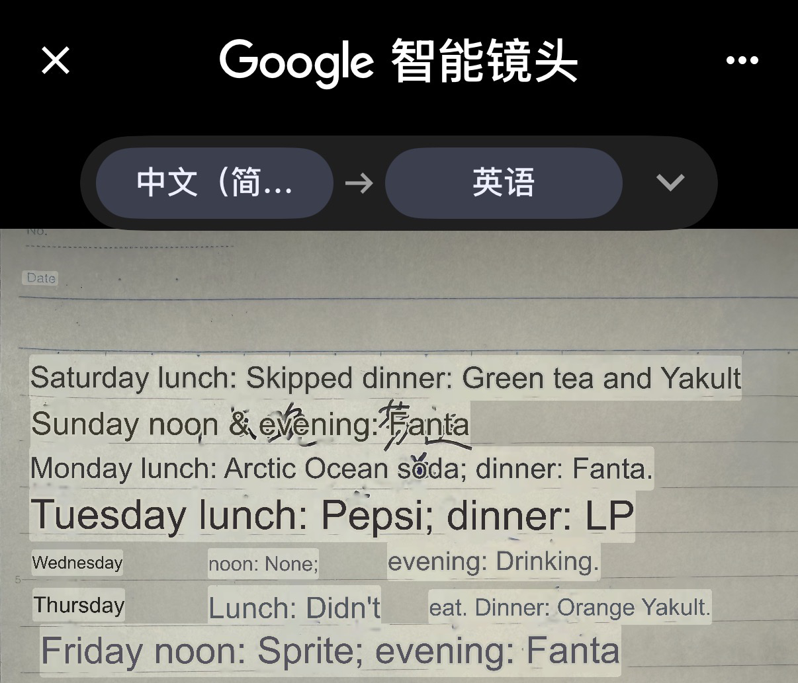

***

## layout: default

# Week 01

[← Back to Home](../index.md)

# Documentation

## Group Data Portrait

### Step 1: Collect

Base on the conversation in our group we decide to crate 5 queasitons that related to our uni life. After a short brainstorm the five queastion we made are:

- What is your favourate courese in Design?
- How long do you work on design per week?
- What kind of way you came to school?
- How long does it take you to uni?
- How do you fell on avarge at Uni in 1-10?

Follow the instructions we create a board to present all of the answer from our group mate. We use differnt colour sticker to showing the different people.

### Step 2: Visualise

After we collected the data, we didn't realize that it was a design school course at first. We initially did not break away from the display type of charts for all data visualization methods. Maybe it’s because I studied INFOMGT 192 for one semester last semester. Looking back at it later, it seems that we were too unimaginative at the beginning.

We each use the same colored post-it note to answer the question. In this way, the answers of different people can be displayed and all the answers of each person can be traced.

After some discussion, we freed our minds and started getting creative in how we embodied our data. We used sticky notes to make models of buses and cars to represent two different ways of going to school. For this purpose we created two miniature map scenes. One is a parking lot with parking signs, and a bus stop.

Through brainstorming we came up with many other ways to present our data. For example, use from 😊 to 😔 to show how you feel today. Use the number of hearts to show the favourate for a course and use the size of the sticky notes shows time spent working on design. 

### Step 3: Decode

Its creative presentation surprised and impressed me. They connected the answers to each question with lines and used symbols and icons to explain the questions and their data. They used different coloured lines to represent each person’s information. This approach was not used in our data visualisation, but they kept using it. Unlike us, who tried to minimise the use of numbers, they still used many numbers for time, weight, and number of siblings. The use of numbers, together with different colours to connect the answers, made it easier for me to understand and find each person’s responses.

Their themes and the questions based on them focus more on personal life rather than school life, which provides information such as weight, sleep schedule, and number of siblings, making it easier to guess who each person is.

## Independent Data Portrait

### Step 1: Choose a topic

Among many options, I chose to observe and record the soft drinks I consume with my meals each day. As a loyal soft drink user, I have a soft drink with every meal. This week, I recorded the various soft drinks I had for lunch and dinner, trying to find my favorites.

### Step 2: Collect data by hand

I chose to use a page of my notebook to take notes. Although I often forget to write things down, the good thing is that this topic can be recalled later, unlike some other topics that are lost if not recorded at the time.

I recorded all the drinks I had for lunch and dinner throughout the week. Since I don't have a fixed habit of eating lunch, many lunch records are blank.

English translation of the data collected
### Step 3: Design your visualisation

After recording my drinks across the week, I converted the information into a hand-drawn visual system that shows what I drank at lunch and dinner from Saturday to Friday. I arranged the composition horizontally by day, with each day divided into two levels: the upper area represents lunch and the lower area represents dinner. This structure makes the weekly rhythm easy to follow and allows differences between meals to appear clearly.

Instead of writing each drink name directly in the final visualisation, I used a combination of shape and colour to build a coded language. Shape represents the company or brand of the drink: for example, circles stand for Coca-Cola, squares stand for Pepsi, rectangles represent Coco, stars represent Arctic Ocean, triangles represent L&P, and the zigzag form represents alcohol. 

Colour is used separately to indicate flavour, such as dark green for green tea, beige for Yakult, orange for orange flavour, black for kola, light green for lemon, and yellow for alcohol. By combining these two visual variables, each drink can be recognised through both its brand and flavour at the same time.Under such a visual language, different sodas can be quickly positioned through brands and flavors. Even non-existent drinks such as 7Up can be represented by green squares.

This method helped me transform simple weekly records into a more vivid, interesting, and layered data chart. Instead of presenting information in tables or graphs, it uses recurring shapes and colors to reveal different patterns, such as certain flavors appearing more frequently than others, or a stronger preference for a particular company's products. This method retains the function of displaying information while adding fun and visual appeal.

### Document your process

To capture the full scope of your practice, each entry in the Making Journal must include a mix of visual and textual evidence, such as sketches, screenshots, GIFs, diagrams, process notes, instructions and reflections.

Write a short reflection (300–500 words) addressing:

- What did you choose to track, and why?
- What was it like to collect and visualise this data?
- What did you notice that you wouldn't have otherwise?
- What choices did you make for your data collection? What does it emphasise? What is left out?
- How does this exercise relate to data humanism and the *Dear Data* project?
- Any other reflections?

## AI Usage Statement

*Document any use of AI tools under an AI Usage Statement heading. Explain which tools you used and describe how you used them. Reference any AI-generated content (see* *[QuickCite](https://auckland.libguides.com/referencing-generative-ai-tools)* *for guidance).*
