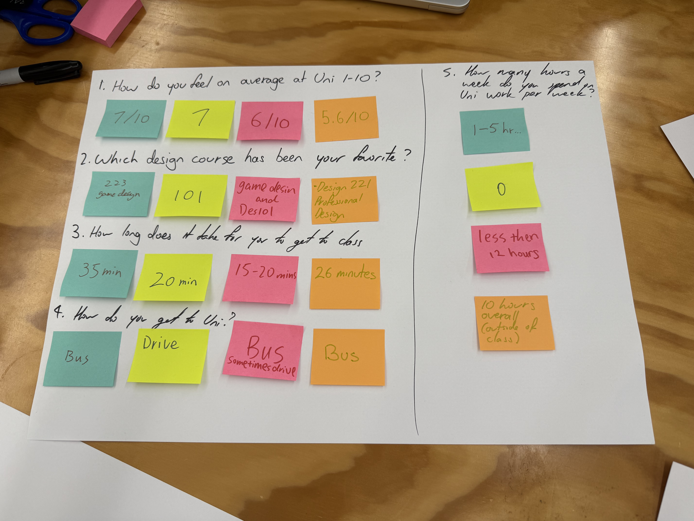

***

## layout: default

# Week 01

[← Back to Home](../index.md)

# Documentation

## Group Data Portrait

### Step 1: Collect

Base on the conversation in our group we decide to crate 5 queasitons that related to our uni life. After a short brainstorm the five queastion we made are:

- What is your favourate courese in Design?
- How long do you work on design per week?
- What kind of way you came to school?
- How long does it take you to uni?
- How do you fell on avarge at Uni in 1-10?

Follow the instructions we create a board to present all of the answer from our group mate. We use differnt colour sticker to showing the different people.

### Step 2: Visualise

After we collected the data, we didn't realize that it was a design school course at first. We initially did not break away from the display type of charts for all data visualization methods. Maybe it’s because I studied INFOMGT 192 for one semester last semester. Looking back at it later, it seems that we were too unimaginative at the beginning.

We each use the same colored post-it note to answer the question. In this way, the answers of different people can be displayed and all the answers of each person can be traced.

After some discussion, we freed our minds and started getting creative in how we embodied our data. We used sticky notes to make models of buses and cars to represent two different ways of going to school. For this purpose we created two miniature map scenes. One is a parking lot with parking signs, and a bus stop.

!\[]\(IMG\_0357.HEIC null)
Through brainstorming we came up with many other ways to present our data. For example, use from 😊 to 😔 to show how you feel today. Use the number of hearts to show the favourate for a course.

### Step 3: Decode

We exchanged with another group, and after seeing the other group's work, I was pleasantly surprised by its creative presentation method. They connected the answers to each question with zigzag lines, and also used symbolic icons to illustrate the questions and their data.
!\[]\(IMG\_0359.HEIC null)
The questions they ask are relatively more focused on how individuals' lives are different from ours, so it's relatively easy to identify each of them. At the same time, they use numbers more frequently than we do.
!\[]\(IMG\_0360.HEIC null)

## Independent Data Portrait

### Step 1: Choose a topic

I choose to come and observe the drinks I drink with my meals every day. Went to keep track of the different drinks I had for lunch and dinner to try to find my favorite drink.

### Step 2: Collect data by hand

Carry a small notebook, use the back of a receipt, or whatever is convenient. Record your observations as they happen.

Don't rely on apps or digital tools. The act of noticing and writing things down is part of the exercise.

Be as specific and honest as you can. Include details that feel imperfect, ambiguous, or hard to categorise.

### Step 3: Design your visualisation

After your collection period, create a data drawing on one side of A4 card.
!\[]\(image.png null)
Invent a personal visual language: use colour, shape, position, pattern, size, and texture to encode different aspects of your data. On the reverse side, draw a legend that explains your visual system.

### Document your process

To capture the full scope of your practice, each entry in the Making Journal must include a mix of visual and textual evidence, such as sketches, screenshots, GIFs, diagrams, process notes, instructions and reflections.

Write a short reflection (300–500 words) addressing:

- What did you choose to track, and why?
- What was it like to collect and visualise this data?
- What did you notice that you wouldn't have otherwise?
- What choices did you make for your data collection? What does it emphasise? What is left out?
- How does this exercise relate to data humanism and the *Dear Data* project?
- Any other reflections?

## AI Usage Statement

*Document any use of AI tools under an AI Usage Statement heading. Explain which tools you used and describe how you used them. Reference any AI-generated content (see* *[QuickCite](https://auckland.libguides.com/referencing-generative-ai-tools)* *for guidance).*
