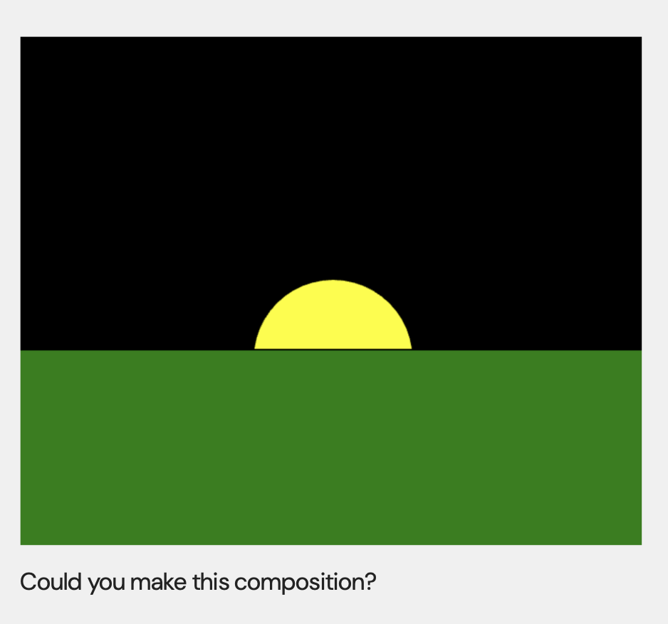
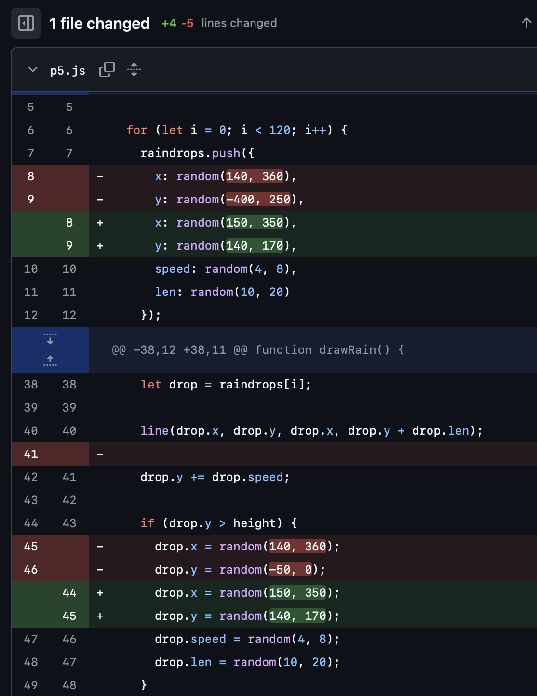

# Week 02

[← Back to Home](../index.md)

# Documentation 
## In-Class Activities
### Activity 1: Drawing with Code
After learning some very basic p5.js drawing functions such as:

```javascript
rect()  
circle() 
fill()  
strokeWeight()  
background()  
```

I decided to directly recreate the composition shown in the PowerPoint slide. I thought this was a good starting point because the image itself was very simple, but it still helped me practise how shapes, colour, and layering work in p5.js.


example in PPT

At the beginning, the two rectangles and the circle were very easy to make. I mainly just needed to think about the layering order. For example, the black rectangle had to be drawn first as the sky, then the circle, and then the green rectangle in front so that part of the circle would be hidden. This helped me understand that in p5.js, shapes drawn later appear on top of earlier ones.
However, after I finished the main shapes, my teacher pointed out that I also needed to think about the black line in the middle of the composition. At first I did not pay much attention to it, because I was only focused on the three main shapes. After thinking about it more, and with the teacher’s reminder, I realised that I could use `strokeWeight()` function to make the green rectangle show its outline, thus blending it with the black rectangle to create this effect.
<iframe src="https://editor.p5js.org/chengyuehan/full/3TCngiL9Z"
width="400"
height="400"></iframe>

After thinking about it more, I realised there were also other ways to create the black line in the middle. Instead of relying on the outline of the green rectangle, I could draw the line separately using `line()`. At the same time I remove the black rectangle, change the background to black colour.This made me realise that there are many different ways to achieve the same visual result. For example, I also thought about only drawing a half circle to create the same sunset effect. This helped me understand that one image can have multiple coding solutions.

<iframe src="https://editor.p5js.org/chengyuehan/full/eHpEkT5fW"
width="400"
height="400"></iframe>


### Activity 2: Make an Interactive Sketch

For this activity, I created a sketch using the DOM elements introduced in class, including `createSlider()`, `createButton()`, and `createInput()`. I used three interactive controls that directly change what appears on the canvas.

The `createInput()` allows the viewer to type any text, which will then be displayed on the canvas. This makes the content of the sketch change depending on what the user enters. The `createSlider()` controls the size of the text. When the slider moves, the text becomes larger or smaller. The `createButton()` changes the colour of the text randomly each time it is pressed.

These controls allow the viewer to change both the appearance and the content of the sketch. Compared to a static drawing, this makes the visual more flexible and interactive. Through this activity, I learned how user input can be connected to variables, and how these variables can control visual elements such as size, colour, and text.

<iframe src="https://editor.p5js.org/chengyuehan/full/kR-flsQxM"
width="400"
height="400"></iframe>


！！！Use the p5.js reference Links to an external site. to try DOM elements we haven't covered, like createSelect() or createCheckbox().

### Activity 3: Vibe Code an Interactive Sketch

In Activity 3, I decided to experiment with ChatGPT as a tool for vibe coding. Instead of coding write prompt is more easier to me, I wanted to see how AI could help me quickly turn a simple idea into a working visual outcome. After thinking about different options, I chose to generate a raining cloud animation. I entered a short description of the requirements, and ChatGPT produced the initial code for the sketch. 

<iframe src="https://editor.p5js.org/chengyuehan/full/VZShlG9A-"
width="400"
height="400"></iframe>

The first version successfully created basic effects of clouds and rain in just a few seconds, demonstrating the power of GPT. However, it also presents an obvious problem: some raindrops emerge from above the clouds rather than from below. This makes the animation look illogical because the rain should visually come from the bottom of the cloud rather than the top. Although AI can generate code very quickly, getting usable code on the first answer is still difficult at this point in time.

I then described this bug to ChatGPT and asked it to fix the problem. After the code was revised, the rain was generated from the lower part of the cloud, which made the overall animation look much more natural and believable. 

<iframe src="https://editor.p5js.org/chengyuehan/full/Lc83HUJXV"
width="400"
height="400"></iframe>


By looking at GPT's changes to the code, I learned how to fix similar problems. This happens because the raindrops are generated at the top of the screen rather than underneath the clouds. Just change the value from to below the cloud. This happens because the raindrops are generated at the top of the screen rather than underneath the clouds. Just change the value from to below the cloud. In this round of changes, GPT changed the random number of the y-coordinate of the randomly generated raindrops from -400 to 250 to 140 to 170, so that the raindrops are generated at the position of the clouds.

Finally, I asked GPT to generate an umbrella without raindrops under it. The X-axis of the umbrella is locked, and the Y-axis moves with the mouse. GPT was completed very successfully.

<iframe src="https://editor.p5js.org/chengyuehan/full/OIlQcpHZ2"
width="400"
height="400"></iframe>


## Independent Study: Interactive Data Portrait

### Step 1: Translate your data drawing into code

For this step, I looked back at the drink data I collected by hand in Week 01 and thought about which parts could be translated into a p5.js sketch. In my original drawing, the main information included the day of the week, whether the drink was for lunch or dinner, the company, the flavour, and the company of the drink. Some of these were easier to define in code than others.

The clearest categorical values were the day, meal type, company, and flavour. These could all be stored as labels in code. For example, the days run from Saturday to Friday, the meals are divided into lunch and dinner, and each drink belongs to a company and a flavour category. These were the most straightforward parts to represent in p5.js because they can be organised clearly using arrays or objects.

The most difficult part was the Irregularly sized bubble chart shapes. In my hand-drawn version, the different sizes were partly based on visual judgement rather than a strict numerical system. This is a big challenge for me to use P5.JS to reproduce

### Step 2: Design your interactive visualisation

In this stage, I translated the structure of my hand-drawn data portrait into a p5.js sketch and introduced interaction so that viewers can explore the dataset dynamically.

At first, I tried generating shapes randomly, but many shapes overlapped or clustered together, making the visualisation difficult to read. To improve readability and visual consistency, I divided the canvas into a grid structure. Each day occupies one vertical column, and each column is divided into two zones: Lunch and Dinner. Instead of placing shapes randomly across the whole canvas, each group of shapes is generated within a defined coordinate range. This ensures that the layout remains structured and aligned, while still allowing variation inside each area.


To introduce interaction, I used a DOM element from the p5.js library: `createSelect()`. This dropdown menu allows viewers to filter the data by meal category:
- All
- Lunch only
- Dinner only

When the viewer changes the selection, the sketch updates immediately to display only the relevant data points. This interaction reveals patterns that were less obvious in the static drawing. For example, users can quickly see which days contain missing lunch data, or identify how flavour types are distributed across dinners during the week.

Compared to the original drawing, interaction allows the viewer to focus on one layer of the dataset at a time. This makes the structure of the data clearer and reduces visual overload when interpreting multiple categories simultaneously.

<iframe src="https://editor.p5js.org/chengyuehan/full/o6L7vtVwq"></iframe>


### Step 3: Iterate

Test your sketch. Show it to someone else and observe how they use it. Refine the interaction based on what you observe.

Document Your Process
To capture the full scope of your practice, each entry in the Making Journal must include a mix of visual and textual evidence, such as sketches, screenshots, GIFs, diagrams, process notes, instructions and reflections.

Include reflective writing that addresses the following:

What data and visual aspects from Experiment 1 did you choose to work with, and why?
How did you decide which interactive elements to use?
What can a viewer learn by interacting with your sketch that they couldn't from your hand-drawn portrait?
Did you use vibe coding or other tools in your process? What did you learn from this?
What would you develop further with more time?
Any other reflections?

## AI Usage Statement

*Document any use of AI tools under an AI Usage Statement heading. Explain which tools you used and describe how you used them. Reference any AI-generated content (see [QuickCite](https://auckland.libguides.com/referencing-generative-ai-tools) for guidance).*
