# Week 03

[← Back to Home](../index.md)

## Documentation

## In-Class Activities

### Activity 1: Explore with cURL

I found the answers to the first three questions by looking at [wttr.in's document](https://wttr.in/:help).

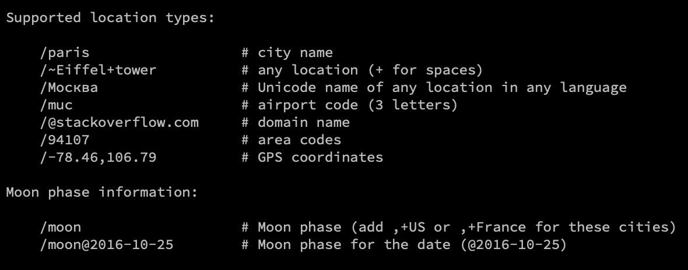

#### Get the weather for a location using its GPS coordinates

```terminal
curl wttr.in/12,106
```
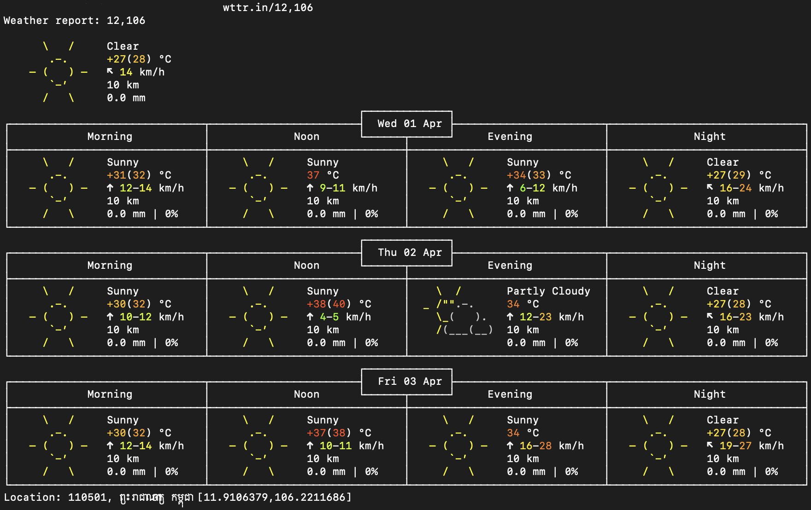

#### Get the weather in a different languaged

```terminal
curl wttr.in/北京
```
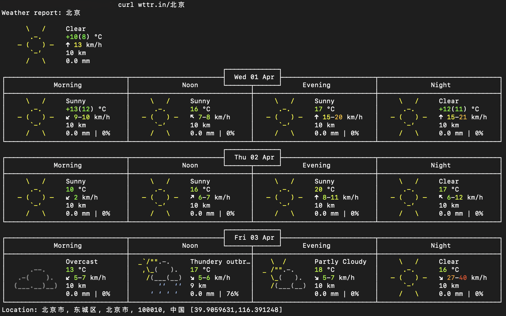

### Get the current moon phase

```terminal
curl wttr.in/moon
```
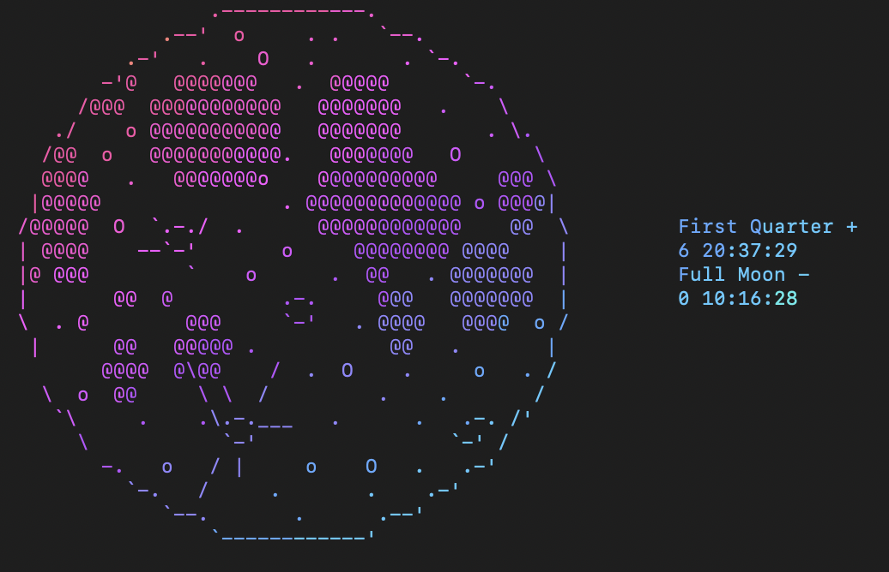

### Look up the synonyms and antonyms of a word

```terminal
curl https://api.dictionaryapi.dev/api/v2/entries/en/cry  
```
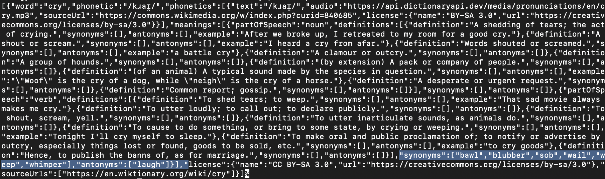

### Find something else in the documentation that we haven't covered

```terminal
curl parrot.live
```
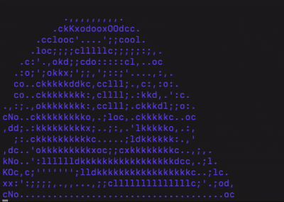


### Activity 2: Weather Visualisation

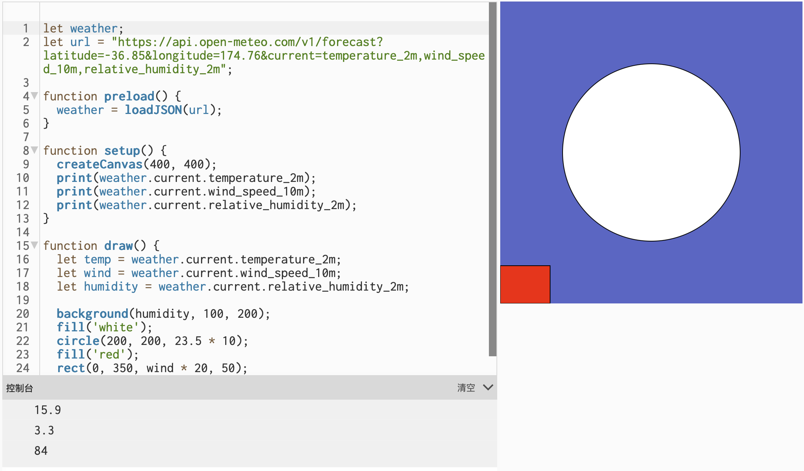

#### Change the latitude and longitude to a different city and observe how the sketch changes.
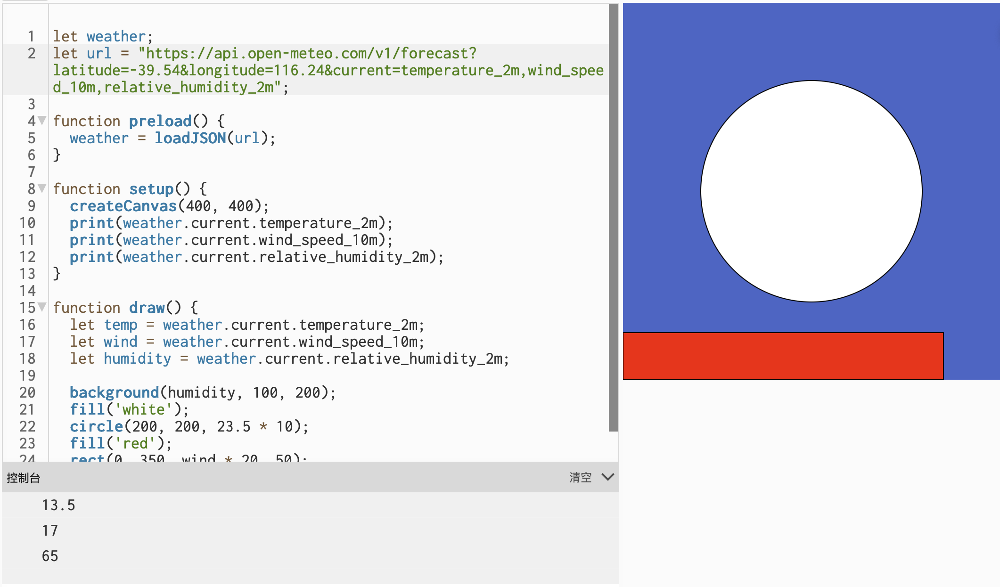
change city to Beijing

#### Use the data to control different visual properties: colour, position, size, number of shapes.
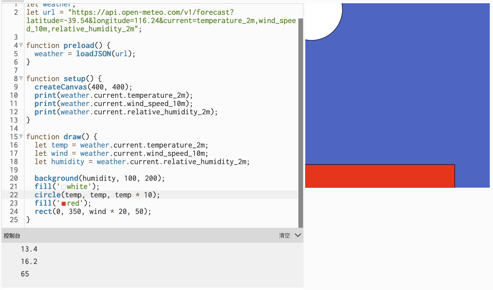
use temp data control circle locaton 

#### Add more weather variables from the Open-Meteo documentation Links to an external site. to the API URL.
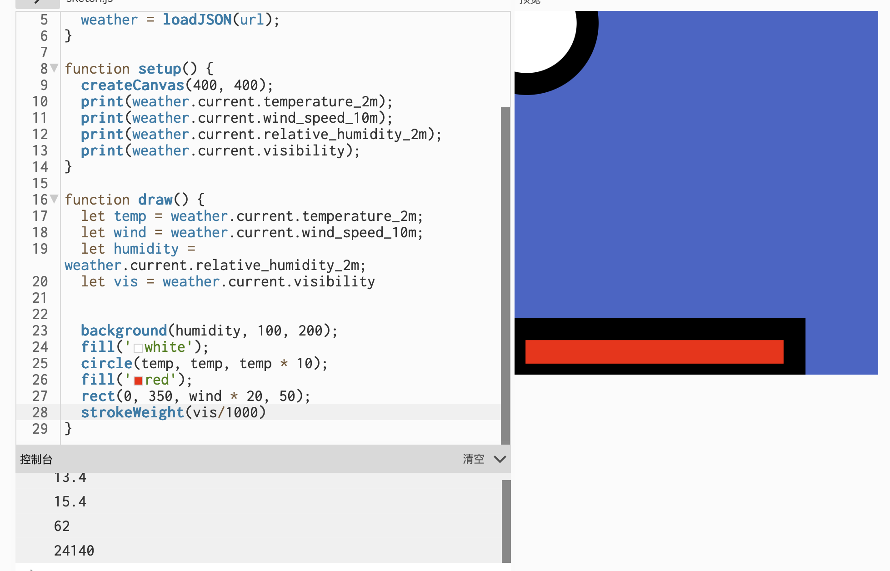
use visibility control the `strokeWeight` of rectangale 

#### Try using random() or noise() alongside or instead of the live data.
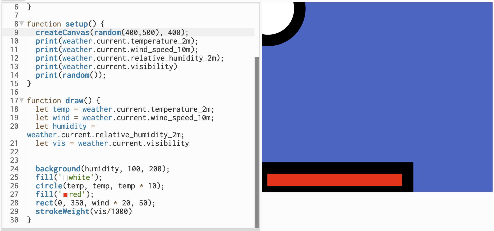
use `ramdom()` fuction control the canvas size 

#### Use vibe coding to try something more ambitious.
<iframe src="https://editor.p5js.org/chengyuehan/full/PExUhh-FC"
width="700"
height="600"></iframe>
With the help of vibe coding, a bunch of clouds are generated, and the speed at which they float away depends on the wind speed returned by the API. Three city options are also provided to see the difference.

### Activity 3: Design and Execute a Data Protocol

In this activity, we design a data protocol and then exchanged it with another group. The idea was to create a set of instructions that could translate live data into a visual form, similar to how an API gives rules for receiving data.

Our protocol was about the first language spoken by the members at the table. The source was the people in our group, and it had to be updated whenever the table members changed, including when someone joined or left. The mapping was a pie chart, showing the proportion of different languages. I thought this idea was quite interesting because it turned changing social data into a familiar chart form. However, when another group tried to follow our protocol, it became clear that our instructions were not specific enough. They found it confusing and did not fully understand what we meant. The relatively vague instructions and non-fixed update times may have caused some ambiguity. Even that, they still returned sufficiently good data in the end.


The protocol we received from the other group was about the number of people using their phones in the room. The frequency was every 30 seconds, and the mapping was to draw one small stick figure holding a phone for each person observed. Compared with ours, their protocol was much easier to understand and follow. It was more direct, more literal, and much faster to record during the activity.


After comparing the two sets of results, our protocol required the return of the pre-processed data, while theirs required the raw data. When using a computer, pre-programming (e.g., using p5.js) allows the computer to display, process, and analyze the data in real time, but this is too cumbersome for handwriting. This is why I let the update time to change whenever the person increse and decrese at the table rather than just a fixed time.

### Independent Study: Live Data Visualisation & Reflction

I chose a digital approach because I think it is easier to create a stronger visual effect in p5.js than with a physical method. Since the project involves live, changing data, using code also made more sense, because the sketch can keep updating and respond to new information.

The real-time data source I used was the Binance API, specifically recent ETH/BTC trading data. I chose it because I'm also interested in cryptocurrencies, and the Binance API doesn't require an API key. I could directly access the API and obtain the data using the `loadjson()` function. Cryptocurrency prices and trading behavior are inherently highly volatile, making them very suitable for the concepts of conflict and movement. Initially, I considered presenting the data in a more realistic way, but later I decided that processing the data as a battle for territory would be more interesting. I didn't want to just display numbers on a screen, so I transformed the data into a territorial struggle. I analyzed the direction of recent transactions and used this as a justification for territorial expansion.
<iframe src="https://editor.p5js.org/chengyuehan/full/ngcUJXHTq"
width="700"
height="600"></iframe>

In terms of visual mapping, I tried to keep it simple while making sure that each part had a clear meaning. The count of recent trade directions determines which territory is advancing. Through the designed the algorithm, I divided the trades into two types: trades where Bitcoin is exchanged for Ethereum, and trades where Ethereum is exchanged for Bitcoin. If there are more trades exchanging Bitcoin for Ethereum, then Ethereum is considered stronger. If there are more trades exchanging Ethereum for Bitcoin, then Bitcoin is considered stronger. The difference between the two counts controls how much the frontline shakes. I used orange for Bitcoin and blue for Ethereum so the two sides could be clearly distinguished. I also added small particles near the frontline so that the middle area would feel less static and more like a conflict zone.

I think this work mainly reveals the short-term competition and shifting pressure in the data. By turning the data into territories, the sketch makes imbalance easier to notice. When one direction appears more frequently in recent trades, that side takes up more space, so the market is no longer just numbers, but becomes something spatial and unstable. My work relates to Conditional Design in that both start with a defined rule and let the result generate itself. Like Conditional Design, I did not decide what the final visual would look like — instead, I designed the condition: trade direction determines territorial expansion. The market data from the Binance API then drives the outcome automatically. Whatever the result is, it comes from the data itself, not from my direct control.

During the process, I used ChatGPT to assist with coding, understanding the API, and developing the concept. It helped me achieve what I wanted, especially when I wanted to try a more ambitious idea. At the same time, I still had to make the actual design decisions myself. For example, when deciding the algorithm for territorial expansion, the first version GPT gave me, after being interpreted by Claude, was still related to transaction prices, which was not what I wanted. After discussing it further with GPT, we redesigned the algorithm so that it was based only on trade direction.

If I had more time, I would strengthen the war effect by redesigning the frontline so that it looks less like a straight dividing line and more like an unstable battlefield. I would also make each data update more visibly noticeable, for example by showing text such as +1 or -1 inside the ETH or BTC area whenever the ETH to BTC or BTC to ETH count changes. I would also improve the movement of the particles so that they move in the direction of the side that is attacking.

## AI Usage Statement

I used artificial intelligence tools throughout the project to help. AI provides me with ideas and technical support to implement all code and physical content. At the same time, AI helps me translate and polish the Journal during the writing process.

OpenAI. (2026). *ChatGPT* (GPT5.4 Thinking) [Large language model]. https://chat.openai.com/chat