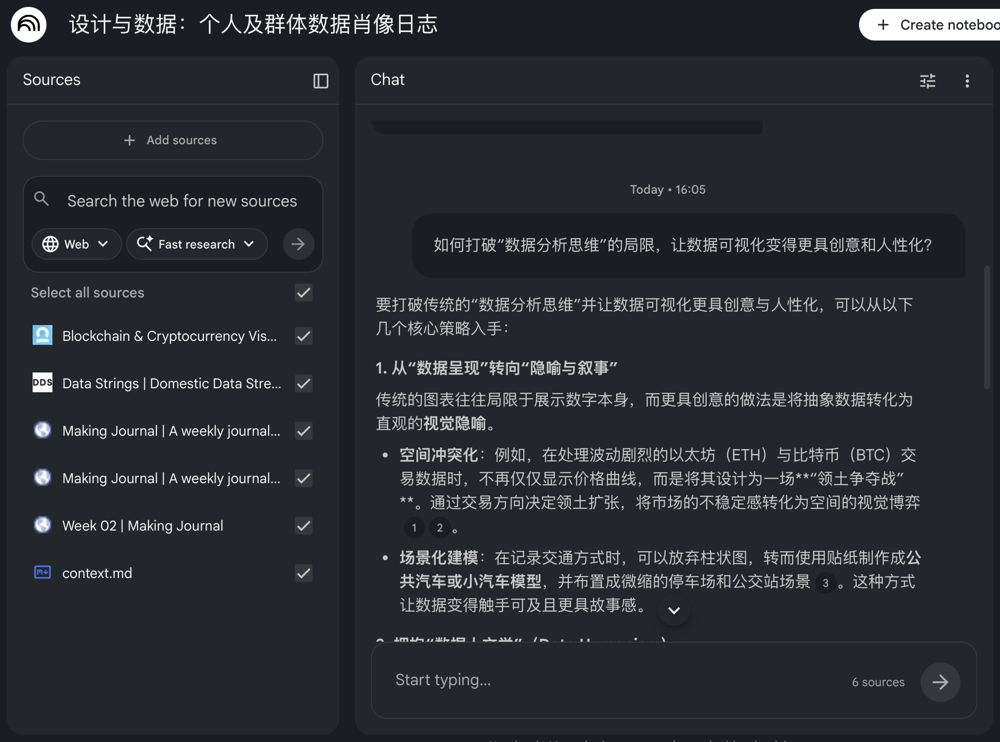
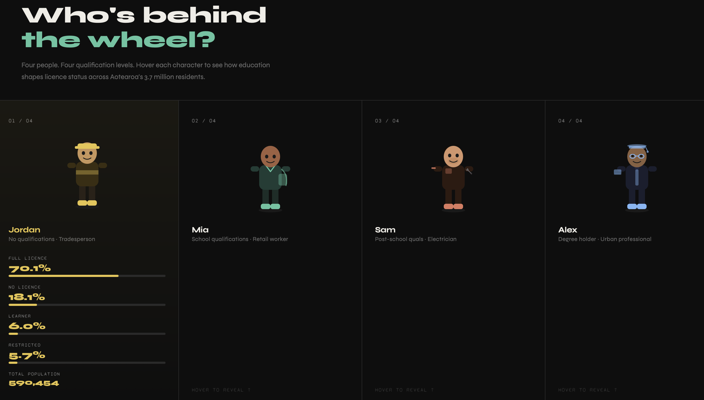

# Week 04

[← Back to Home](../index.md)

## Documentation 

## In-Class Activities

### Activity 1: Local AI with Ollama

In this activity, I chose to use qwen3 8b as the local model. I tried having them write some p5.js code and then comparing their code with online AI.

```Prompt
create a flowing fountain using p5.js.
```
<iframe src="https://editor.p5js.org/chengyuehan/full/nmSEbdKCz"
width="600"
height="500"></iframe>
Gemini 3.1 Pro

<iframe src="https://editor.p5js.org/chengyuehan/full/BTg06M9pH"
width="600"
height="500"></iframe>
GPT5.4 Thinking

<iframe src="https://editor.p5js.org/chengyuehan/full/eEjDN7Zjm"
width="600"
height="600"></iframe>
Qwen 3 8B

While using ollama's local model, I heard my computer fan start spinning. This took more than a minute, while ChatGPT and Gemini only took a few seconds. In terms of code quality, both GPT and Gemini successfully reproduced the water flow of the fountain using only this small piece of prompting text. GPT even successfully replicated the shape of the fountain's base. In contrast, Qwen only replicated a bunch of bubbles floating upwards. 

This highlights the significant gap between cloud-based AI and on-premises AI today. While on-premises AI is superior in terms of privacy, it falls short in terms of speed and capabilities due to limitations imposed by the devices available to the average person, making it unsuitable for demanding coding tasks.

At least for today, privacy and capability remain at opposite ends of a balancing act. While cloud-based models can be configured to not use one's own data for training, compliance is largely beyond human control. Local models, on the other hand, while having all data locally and offering equally powerful performance at maximum parameters, are limited by the capabilities of human devices, restricting the number of parameters usable and making them insufficient to replace most tasks at present.

### Activity 2: Cloud AI with NotebookLM

For this activity, I used NotebookLM to gather together the sources that reflect my experimentation so far in this course. I added my Making Journal, several external references that influenced my thinking, and a short context document to guide the AI. 



NotebookLM's automatic question recommendation feature revealed many possibilities and content I hadn't discovered before. By analyzing all my files, it automatically suggested several questions I might be interested in, such as how to break free from the limitations of "data analysis thinking" and make data visualization more creative and human-centered. It not only summarized useful information from each source but also provided many helpful suggestions. I could also engage in deeper Q&A sessions with the responses, gaining a better understanding of my interests and concerns from different perspectives.

## Independent Study: AI-Assisted Data Exploration

### Step 1: Find a Dataset

I chose the [New Zealand Driver's License Holding Rate dataset](https://catalogue.data.govt.nz/dataset/rates-of-driver-licence-holding-in-aotearoa-nz) because it is closely related to the daily lives of New Zealanders. Driver's license ownership affects people's opportunities for employment, education, healthcare, and social interaction, especially in areas with limited public transport access. I am interested in this dataset because it allows us to view the driver's license issue not only as a transportation problem, but also as a social and spatial one.

### Step 2: Understand the Data

After speaking with Claude, I gained a much better understanding of the data. It's a very complete and well-organized percentage-based dataset, without a large amount of inconsistently formatted data that requires cleaning and processing. The data shows the number and proportion of people with driver's licenses under different segmentation criteria, such as ethnicity and age.

Through this data, I discovered many things that were both intuitive and counterintuitive. For example, full-time employees had the highest licensing rate, but part-time employees (67%) had a lower licensing rate than those "outside the labor market" (68%).

This dataset was created by linking driver's license registers to census records. Its core purpose was administrative and policy monitoring—to understand who still lacks a driver's license. This very purpose introduces a bias: the data only asks who has a driver's license or doesn't have one, never ask why or what does it actually mean for their lives. It reflects a systemic perspective, not a human one.

### Step 3: Design Multiple Representations

Of all the categories, I chose the one that interested me most: categorized by education level. I had Claude generate a visualization, which, after analysis by pands, returned an HTML document[to visualization](../assets/week-04/qual_viz.html)← click to see

The results returned by Claude showed me that there were two different sets of data: one containing only education level and the other containing both education level and age. Therefore, I plan to create three separate visualization: one for those with only academic qualifications, one for those with both academic qualifications and age, and one where age can be viewed in a sub-menu of the academic qualifications table.

#### 1

[click to see](../assets/week-04/qual_characters.html)

Claude created a webpage featuring four different people, each representing a different level of education. However, regarding the data presentation, I advised against using tables and charts, but he still opted for a design resembling an energy bar, which perhaps lacked imagination. I was very satisfied with his automatically generated "Who's behind the wheel?" theme; this description effectively illustrated the meaning of the visualization: using education level to reveal the percentage of people holding driver's licenses, thereby uncovering those who have been overlooked.

#### 2 

<iframe src="https://editor.p5js.org/chengyuehan/full/uzJtfXmRg"
width="800"
height="600"></iframe>

In this iteration, I instructed ChatGPT to try to move away from traditional chart formats and organize the data in a more visually metaphorical way. Instead of directly creating bar charts or line graphs, I transformed the data for different groups into an organic, flower-like form. Each flower represents an age or education level group, the four petals correspond to different driver's license statuses, and the length of the petals and the overall size represent proportions and numbers. The goal was to make the otherwise rigid statistical data more lifelike and to allow viewers to not just "read" the data, but to first visually experience the differences between different groups.

#### 3 

<iframe src="https://editor.p5js.org/chengyuehan/full/rdiLh6q2s"
width="800"
height="600"></iframe>

In this iteration, I discussed my ideas with GPT because I wanted to move the visualisation even further away from traditional chart forms and turn it into a layered, explorable school world. Instead of using bar charts, line graphs, or pie charts, the data was organised into a three-step spatial experience: the four qualification levels became four schools, each school then opened into age-based campus zones, and each selected age group could be expanded again into separate licence-stage spaces. Population size was represented through groups of human icons, while licence status was encoded through consistent visual variations in the appearance of the characters. The aim was to make the dataset feel less like a static graph and more like a navigable environment, so that viewers could understand relationships by moving through the scene rather than simply reading axes and labels. After discussing the idea with GPT, I gave the generated prompt to Codex, which then helped produce this outcome.


### Step 4: Critically Evaluate

In these iterations, I found that AI also tends to default to analytical ways of visualising data. It usually relies on charts, which are also the most common form of data visualisation. Because of this, I had to keep guiding the AI again and again. I needed to state clearly that I did not want traditional chart forms such as bar charts, line charts, pie charts, or tables. I also had to push it to think more from the perspective of design, interaction, and space. I wanted the dataset to be more than something simply displayed on a flat screen. I wanted it to feel more exploratory. Even when it did not directly use bars or graphs, the underlying logic was still very similar, because its main concern remained comparison and clarity rather than a stronger visual concept. Because of this, I needed to introduce creativity already at the prompting stage so that the AI could better understand and produce what I actually wanted.

I also think AI made certain assumptions about both the data and the audience. It seemed to assume that the most important thing was to make the data quick and easy to understand, and that the audience mainly wanted direct comparison. It also treated the dataset as complete and neutral, without really questioning what kinds of experiences or social issues were missing behind the numbers. The most interesting version was the flower version. I think this version was the most successful because it changed the way viewers experienced the data. The audience was no longer simply reading labels and values, but instead looking at a cluster of rotating flowers. This made the work feel more like exploring a universe of multiple planets rather than reading a chart. It was also more memorable than the earlier versions because it was supported by a much stronger concept.

If I had not used AI to build this work, I think I would have spent much more time thinking about ideas for how to present it. AI offered many ideas that felt interesting, and these could inspire me to think in more creative directions. Without AI, that process would have been much more difficult. At the same time, AI wrote all of the code. Without AI, I would not have been able to complete such a polished and refined visualisation in a short amount of time. It would have greatly increased the amount of work required, and the final result might still not have been as successful as this one. From this, I learned that AI can help explore many possibilities, but it still requires a large amount of human direction in order to make the outcome feel more designed and meaningful.

## reflective writing 

In this project, I chose the New Zealand Driver’s License Holding Rate dataset because it is closely connected to everyday life in New Zealand. A driver’s licence is not only about transport. It also affects where people are able to go through mobility, especially in areas where public transport is limited. Because of this, the dataset was meaningful to me, as it can be understood not only as a transport issue, but also as a social and spatial issue.

AI tools helped me understand the dataset more quickly. Claude was able to identify the data structure effectively and clearly show that it was a well-organised percentage-based dataset containing different categories such as age, ethnicity, labour market status, and education level. This saved time and made the dataset easier to work with. However, the dataset only records who does or does not hold a driver’s licence. It does not explain why, nor does it show what not having a licence means for people’s lives. In this sense, it reflects a policy and administrative perspective rather than a human one.

During the design process, I found that AI often defaulted to analytical forms of visualisation. It frequently assumed that data should be presented through charts, or through designs that still followed chart logic. Because of this, I had to repeatedly guide it away from bar charts, pie charts, line graphs, and tables. I wanted the work to feel more exploratory, spatial, and designed, rather than simply focused on clarity and comparison.

This led to multiple iterations. The early version still felt too close to infographic design. The flower version was the most successful because it changed the way viewers experienced the data. Instead of simply reading labels and values, viewers saw a group of rotating flowers, with each flower representing a category through petals, proportion, and movement. This made the work feel more like exploring a small universe than reading a chart. Later, I developed this idea further into a layered “school world,” where qualification levels became schools, age groups became spaces, and licence stages were represented through groups of characters. These different forms of representation made me realise that the form of visualisation can strongly shape what viewers notice and how they emotionally connect with the data.

The ideas of D’Ignazio and Klein made me question the neutrality of the dataset. Their work suggests that data can never be fully neutral, and that the collection of data is often tied to reinforcing the power of those who collect it. The administrative purpose behind this driver’s licence dataset already carries a bias toward non-licence holders, and this bias also shapes the way we think about the data, especially since it contains almost no human perspective. Kirikowhai Mikaere’s discussion of the government’s narrative bias and identity definitions in collecting and designing Māori data also influenced my critical thinking about the ethnicity-related information in the dataset, even though I did not use ethnicity data in the visualisation itself.

Overall, working with AI was both efficient and limited. It helped me quickly explore ideas and generate code, but it still required strong human direction. Without AI, I would not have been able to produce such a refined interactive visualisation in a short time. At the same time, this project made me realise that AI cannot automatically create meaningful design well in this context, and that it is highly sensitive to prompting. It can generate interesting and meaningful design outcomes, but only when the designer describes the concept and direction clearly enough in the prompt. This still requires the designer to have strong ideas, creativity, and originality.

## AI Usage Statement

I used artificial intelligence tools throughout the project to help. AI provides me with ideas and technical support to implement all code and physical content. At the same time, AI helps me translate and polish the Journal during the writing process.

OpenAI. (2026). *ChatGPT* (GPT5.4 Thinking) [Large language model]. https://chat.openai.com/chat

Google. (2026). *Gemini* (Gemini3.1 Pro) [Large language model]. https://gemini.google.com/

Anthropic. (2026). *Claude* (Sonnet 4.6) [Large language model]. https://claude.ai/

OpenAI. (2026). *CodeX* (GPT5.3 Codex) [Vibe Coding Agent]. https://openai.com/codex/
