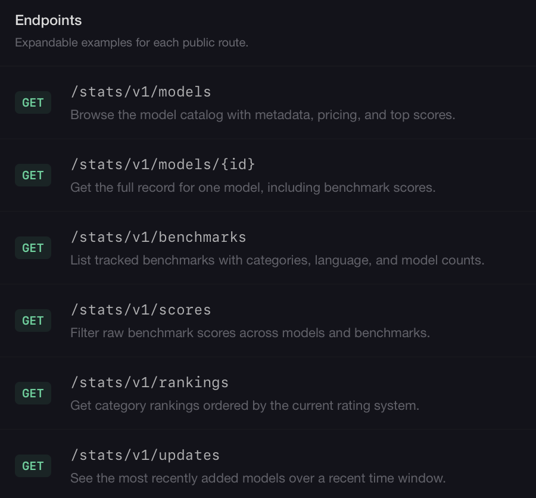
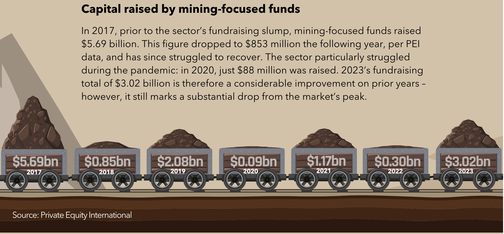
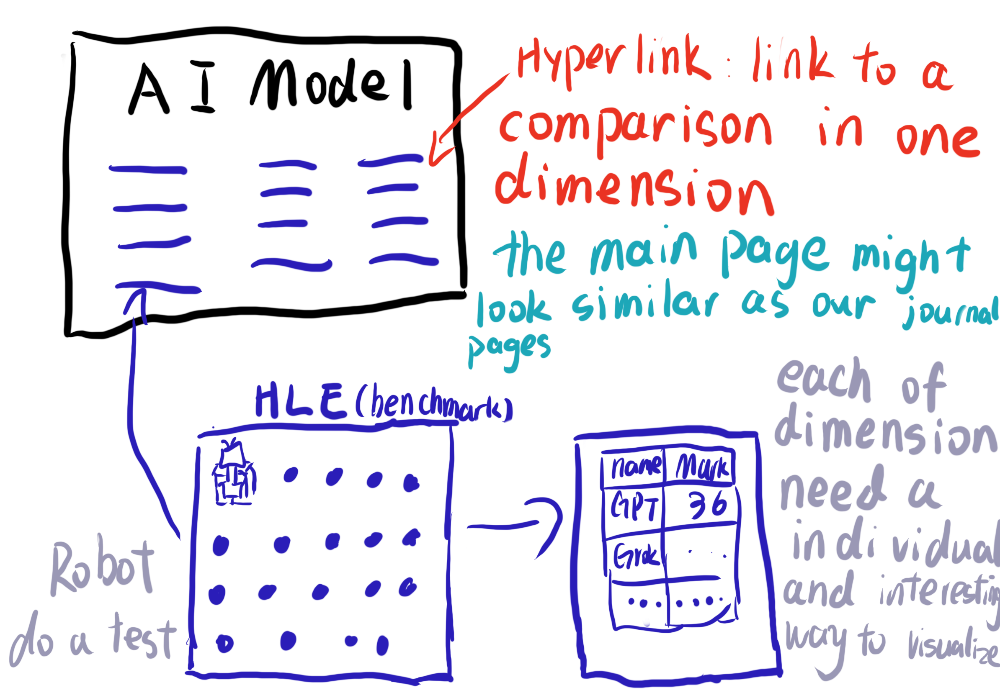
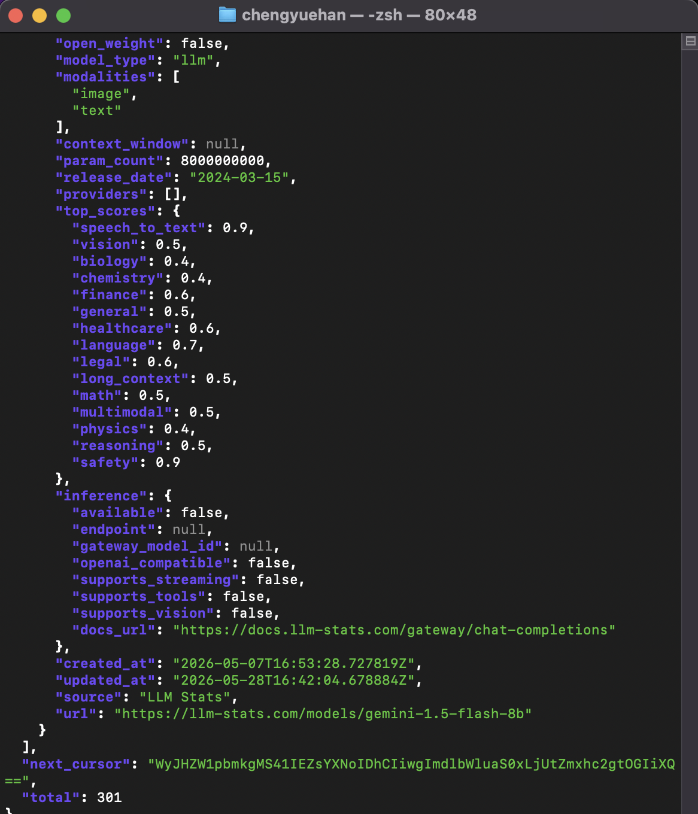
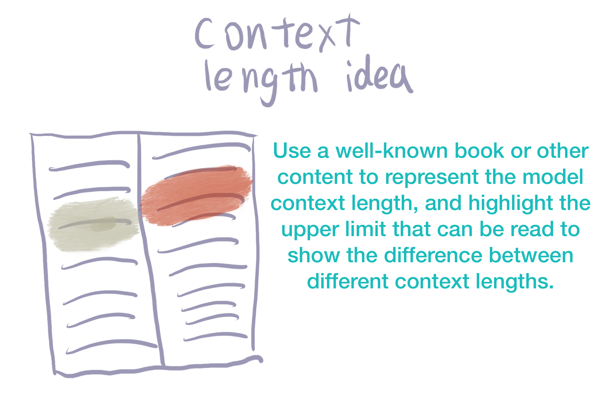

# Week 06

[← Back to Home](../index.md)

## Documentation

## In-Class Activity

## Data Exploration

This week, I began the second stage of the project by looking for a data source that could support my proposal about the AI arms race. After searching for a while, I found the [LLM Stats API](https://llm-stats.com/developer). LLM Stats provides free API access to information about large language models, rather than only presenting the information as a visual leaderboard.

LLM Stats describes its developer API as a way to query benchmark scores, model rankings, pricing, and metadata for the models it tracks. This is very useful for my project because it means I can access organised and continuously updated live data in one place. According to the API documentation page, the API provides access to model lists, single model details, benchmark lists, model score matrices, model rankings, and recently updated models.


*The LLM Stats developer page shows the available API categories, including models, benchmarks, scores, rankings, and recent updates.*

LLM Stats is a REST API. It uses GET requests and returns JSON data. This is very suitable for my project because I do not need to scrape data manually from each model company's website. Collecting this information manually would be very time-consuming and technically difficult. The API also provides updated data, which means the website could update without me having to manually change or add data each time a new model appears. Considering how intense AI competition currently is, and how quickly new models are being released, using an automated data source feels necessary.

I do not see LLM Stats as a limited or weak data source. In fact, it may be one of the strongest data sources for this project because it brings a large amount of information together in one place. It includes a large model catalogue, pricing information, provider details, model metadata, rankings, and scores across a very wide range of benchmark tests. This makes it much more suitable for my project than manually collecting information from individual company pages.

The main issue is not that the data is lacking, but that the amount of data may be too large. LLM Stats includes almost 500 different benchmark scores and nearly 300 models. If I try to include all of this data, the final visualisation could become too complex and overwhelming. This means the main design challenge is data selection. I need to decide which parts of the LLM Stats data are most important to show. For example, I could focus only on well-known large language model companies, then compare them through a few meaningful dimensions such as pricing, capability scores, and context length.


## Visual Research and Precedent Study

### 1. [FLOP Map](https://flopmap.com/)

**What draws me to it?**  
What draws me to FLOP Map was its 3D representation of AI infrastructure. It maps computing clusters onto a 3D Earth model, visually displaying data through bar charts of varying heights.

**What specific quality or approach might I carry forward?**  
Since my final project isn't primarily a world map, its relevance to my research is relatively limited. However, its user interface is a direction I can learn from.

**Does this reference change or reinforce my current direction?**  
This reference material reinforced my research direction. Its UI style clearly indicates it's a Vibe coding website. This is very encouraging because it validates that Vibe coding can create excellent and engaging visualizations.

### 2. [B Lab Global Annual Reports visualisation on Infogram](https://blab.infogram.com/1pg2rxgk96vl5rf95zkdk3mdjwbw05mwrny)

**What draws me to it?**  
What draws me to this visualisation is its report-like format. Compared with other formats, such as a 3D globe, this kind of structure may fit my topic better. I also like its collage-style scrollytelling approach.

**What specific quality or approach might I carry forward?**  
I appreciate its simple report format and started thinking about whether I could use a similar PPT or PDF-like container. The clickable buttons for jumping between different sections are also something I may carry forward.

**Does this reference change or reinforce my current direction?**  
This reference does not really change my direction. I still have some doubts about its overly complex presentation and its heavy use of charts.

### 3. [Number Crunch: PE interest in the mining sector is sliding](https://www.privateequityinternational.com/number-crunch-pe-interest-in-the-mining-sector-is-sliding/)

**What draws me to it?**  
What draws me to this visualisation is its vector illustration style and its non-traditional chart elements, such as mining carts, conveyor belts, and storage tanks. The scrolling animation is also interesting because the visualisation changes as the viewer moves through the page.

**What specific quality or approach might I carry forward?**  
I may carry forward its simple and clear way of showing trends. More importantly, it makes me think about how topic-related objects can become containers for data, like using minerals inside mining carts to represent different values.


**Does this reference change or reinforce my current direction?**  
This reference expands my current direction. It makes me start thinking about how interesting visualisation can turn data into objects that are visually connected to the topic itself.

### 4.[This is Not My Name](https://vis.csh.ac.at/notmyname/)

**What draws me to it?**  
What draws me to this visual essay is that it is not just showing data, but also showing the process of making a data story with AI. This is very relevant to my project because I am also using AI tools during the making process.

**What specific quality or approach might I carry forward?**  
I may carry forward its step-by-step storytelling approach. My project could also guide viewers through the question instead of showing all the model data at once.

**Does this reference change or reinforce my current direction?**  
This reference reinforces the importance of narrative structure. It reminds me that an interactive data project needs a clear question, not only charts.

### 5. 

[PowerTracker](https://powertracker.io/)

**What draws me to it?**  
What draws me to PowerTracker is that it connects AI data centers with electricity and infrastructure. It makes AI feel less abstract and more connected to real places.

**What specific quality or approach might I carry forward?**  
I may carry forward its layering approach. It shows that one dataset becomes more meaningful when it is connected with other systems.

**Does this reference change or reinforce my current direction?**  
This reference reinforces my direction. Even if I use LLM Stats as my main data source, I should still make the visualisation feel connected to a wider AI infrastructure.

## Project Planning and Skills Roadmap

### What do I need to make?



### What do I need to learn?

1. How to access and structure data from the LLM Stats API.
2. How to let the coding agent tools to help me coding.
3. How to make the visualisation meaningful rather than only functional.
4. How to make the visualisation De-charting and tabularizing.
5. How to make the visualisation intersting and creative.

### Next Steps

I need to create an interactive visualisation website that uses LLM Stats model data to compare different AI models through multiple dimensions. The website should not just display model information, but should make the comparison feel visual, interactive, and connected to the idea of the AI arms race.

My next step is to start planning the structure of the whole webpage. I need to think about what sections the page should include, how the viewer will move through the information, and where the interaction should happen. I also need to decide which data dimensions are the most important for the final visualisation, because LLM Stats contains too much information to show everything at once.

At the same time, I need to keep generating creative ideas for how each comparison can be shown. For example, price, capability score, context length, provider availability, and model release speed may each need a different visual method. Instead of turning everything into normal charts or tables, I want to explore how each data dimension can become a more interesting visual object or interaction.

For the next stage, I will focus on planning the page layout and testing a small prototype. This will help me decide whether the final work should feel like a report, a machine system, a comparison interface, or a more narrative visual experience.

## Consultation Reflection

The feedback I received for my proposal was mostly positive. One of the most important points for me was about the form of the final visualisation. In the proposal, I was asked to think about how I would visualise the data, whether it would become charts, tables, or something else. My current thought is that I want to create a more creative form of visualisation.

I understood that I need to connect my idea more closely to the final artefact. Finding LLM Stats as a data source is useful, but the website cannot simply become another table, chart, or leaderboard, because LLM Stats has already done that very well. My task is to create something more creative and distinctive. This is difficult for me, but after the first half of the semester, it feels slightly easier than before. I have started to understand that data visualisation does not have to mean traditional charts. It can also mean finding a visual form that fits the topic.

Next, I need to focus on how to turn the idea into an actual artefact. I need to think about how each data dimension can be translated into a visual form. The final goal is to make a project that can use real data, while still being clearly different from normal data tables or leaderboards.

## Technical Skill Building

For this week's technical skill building, I started with the first point in my skills roadmap: learning how to access and structure data from the LLM Stats API.

At first, I read through the [LLM Stats developer documentation](https://docs.llm-stats.com/api-reference/introduction). I noticed that the documentation could be opened directly in GPT, so I used GPT to help me understand how to access the API. I asked GPT what steps I needed to follow, and it explained that I first needed to configure the API key and then send a request to the correct endpoint.

Following the tutorial generated by GPT, I set up the API key and used `curl` to test the API request. 

```
   curl https://api.zeroeval.com/stats/v1/models \
  -H "Authorization: Bearer YOUR_API_KEY" | jq
```

After running the command, I received a JSON response from the API. 



Through this process, I successfully accessed the API data. The data returned by LLM Stats contains a lot of model information, so I needed to determine which fields were most relevant to the final visualization.

## Initial Concept Sketch

I’ve recently been thinking about new ways to visualize the context length of large language models (LLMs).

Most existing visualizations simply use numbers, charts, or tables — such as 128k, 1M, or 10M tokens. While technically accurate, these numbers are still extremely abstract for most people. The average user has little intuitive understanding of what “one million tokens” actually means.

My idea is to use a well-known book as the reference scale. Highlight the maximum readable portion for each model. The highlighted area represents the amount of information the model can actually “see” and “remember” within a single context window. The non-highlighted area represents information that exceeds the model’s context limit.



## AI Usage Statement

I used artificial intelligence tools to help interpret the LLM Stats data structure, develop a small test dataset based on expected API fields, and support the creation of early HTML prototypes. AI was also used to help translate and polish the writing. The design decisions, project direction, and critical reflections were developed through my own evaluation of the course brief and my previous experiments.

OpenAI. (2026). ChatGPT (GPT-5.4 Thinking) [Large language model]. https://chat.openai.com/chat

## Reference

LLM Stats. (2026). Data API & MCP. https://llm-stats.com/developer
