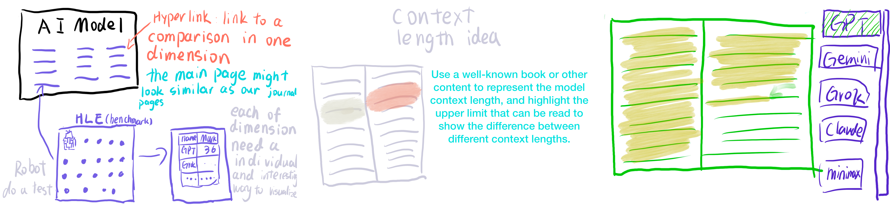
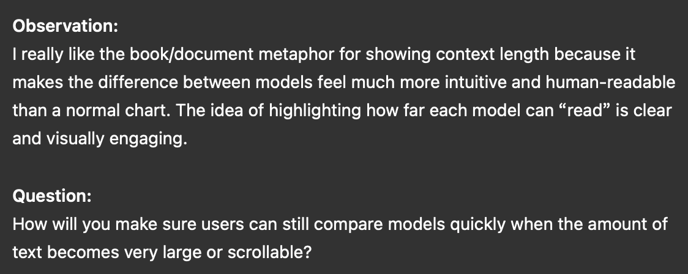
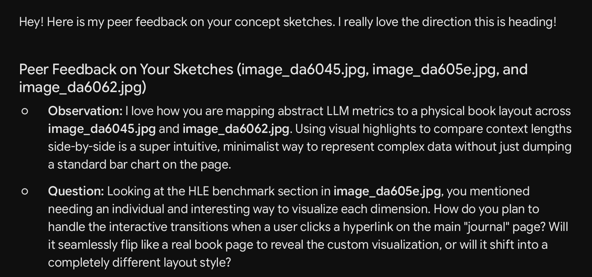
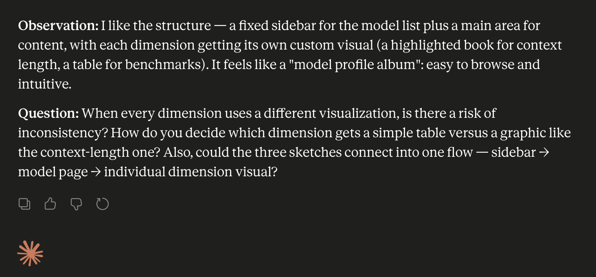
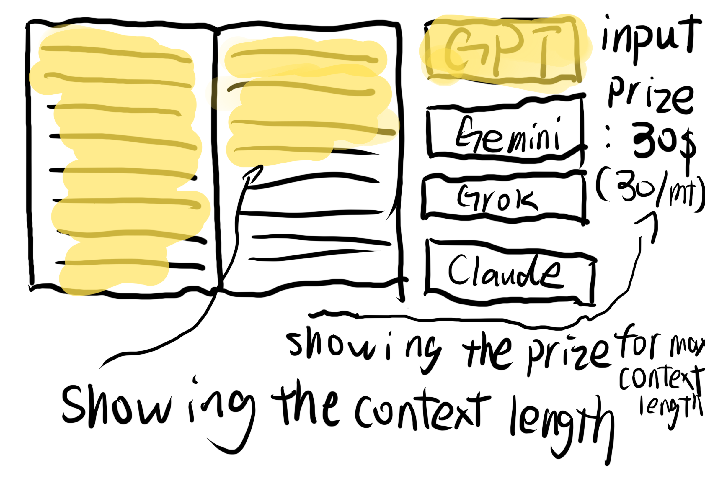

# Week 07

[← Back to Home](../index.md)

## Documentation

## Continuing the Concept Sketch

I was not able to attend the Week 7 class, so I could not receive the in-class post-it note responses from peers. To still respond to this activity, I used AI as a substitute feedback tool. I uploaded my latest concept sketches and asked for observation-and-question style feedback, similar to the peer response activity.

What surprised me was that two AI responses raised the same worry — whether comparison stays fast when content gets large or scrollable, and whether giving each dimension its own visual makes things feel inconsistent. I'd been treating "each dimension has its own look" as purely a strength, so it was interesting to see it framed as a possible downside. What matched my thinking was that the AI agreed the book/journal metaphor is the strongest part — mapping abstract model data onto a physical "page" feels much more intuitive than just dropping in a bar chart, which is exactly what I was going for, so I'm glad it came across clearly. As for what I want to follow up on: I'm going to keep developing my original idea. I've noted the concerns raised, but for now I still want to put the core concept — each dimension getting its own custom visualization — into practice, and judge the results once it's actually built.

## Making Sprint

In Week 6, one of the skills I identified was learning how to let coding agent tools help me with coding. Because of this, my making sprint this week focused on using Codex to test whether the LLM Stats API data could be turned into a small data visualisation.

Last week, I used curl to access the LLM Stats API and understood that the API could return JSON data. This week, I wanted to move one step further. Instead of only reading the JSON myself, I gave the API key directly to Codex and asked it to help me access the data and build a simple webpage from it.

My goal was to test the workflow from live API data to a visible interface. I asked Codex to fetch the model data, select useful fields, and turn them into an data visualisation. At this stage, I was not trying to make the final design. I mainly wanted to see whether vibe coding could help me move from API access to a working prototype more quickly.

[link to the website](https://chengyuehan.github.io/240testapi/)

This was very useful; CodeX provided a complete data visualization in a very short time. Despite some issues with the data, it greatly increased my confidence in the Coding Agent's capabilities and in using it.

However, this prototype also made design problems more apparent. Without having ideas and creativity at the cue word level, the final visual would still be a typical data visualization chart. It used common chart types such as scatter plots, leaderboards, bar charts, timelines, and heatmaps. These charts were useful for the test data, but lacked creativity for the final project.

## What If Variations

Because I did not receive partner suggestions in class, I created three "what if" variations by AI:

1. What if integrated the comparison of functions from different dimensions into a single visual interface?
2. What if the visualisation focused on the cost paid by users rather than model intelligence?
3. What if open-weight models were shown as more publicly accessible spaces, while closed models were shown as locked or opaque territories?

The first variation became the most useful one for me. The goal of my project is to compare AI models from multiple dimensions, such as price, capability, context length, and provider information. However, I realised that putting too many dimensions into one design may make the visual elements too abstract.

This reminded me of some of my previous p5.js experiments. Using multiple variables to control one visual system can be interesting, but it can also make the final result difficult to understand.

Because my goal is to make the data visualisation both creative and intuitive, I do not want to represent the data in a very abstract way through colour, shape, and size like in some of my previous p5.js work. I do not want to force all dimensions into one abstract visual system. Instead, I hope each type of data can have a more direct and readable visual expression.

This variation helped me clarify my direction. I still want the website to compare multiple dimensions, but I do not want the comparison to become visually confusing. The next step is to test how each dimension can be shown intuitively, while trying to combine two or three capability dimensions into one visualisation as much as possible.

After thinking about the first "what if" variation, I made a new sketch to test how two dimensions could be combined in a more direct way.

In this sketch, I focused on combining context length and input price. I chose input price because it can make the context length comparison more meaningful. Context length shows how much information a model can read at once, but by itself it is only a capacity number. When I connect it with input price, it can also show how much it would cost to actually send that amount of text into the model.

This connects to my first "what if" variation, where I wanted to compare multiple dimensions without making the visualisation too abstract. Instead of using unrelated variables, context length and input price naturally belong together. One shows the maximum amount of text the model can take in, and the other shows the cost of using that input capacity.

## Developemt Journal

After making this sketch, I discussed the idea with Claude to test whether it was actually practical. My original idea was to show context length in a one-to-one way. I wanted to use a real book or document as the visual container, and the highlighted area would show exactly how much text each model could contain.

However, after checking the scale of current model context windows, I realised that this idea was not very feasible. Some models already have extremely large context windows. For example, Grok 4 supports a 2 million token context window for developers. According to OpenAI's explanation, 1 token is roughly 0.75 words in English, so 2 million tokens is around 1.5 million words. This is already much larger than a normal book.

This created a problem for my visual idea. If I wanted to use a book as the visual container, it could not just be any random book. It would need to be a very well-known book, because the viewer would need to understand what it means when the model can read up to a certain part of the story. For example, if the visualisation showed that one model could reach the middle or end of a famous book, the viewer could understand the context length more intuitively.

The problem is that this is not realistic with current context lengths. To fill a 2 million token window, the book would have to be enormous — far longer than any normal novel. Books that are actually long enough exist, but they are not well-known. The longest public-domain book in the world, Artamène, ou le Grand Cyrus, is about 2.1 million words, but almost no one has heard of it. So even if the length fits, the viewer would have no sense of where "the middle" or "the end" of that book is, and the intuitive comparison I wanted would not work.

Claude also reminded me about copyright. If I used a real book as the visual material, I would need to use an open-copyright or public-domain book. This made the idea even more limited, because I could not freely choose any famous book just because it was easier for the viewer to understand. The well-known books are copyrighted, and the public-domain books that are long enough are unknown.

Because of this, I decided to give up this specific one-to-one book idea. I still think the book/document metaphor is interesting, but using a real book to literally show full context length is not practical for my project. The books that are famous enough to be intuitive are either too short or copyrighted, and the books that are long enough are too obscure for anyone to read the highlight against. For now, I need to find a simpler way to represent context length without trying to show the exact amount of text directly.

## Technical Skill Decision

After spending several days exploring this design idea and finding that it was not feasible, I shifted my focus to the technical side of the project. I had already started thinking about whether to keep using p5.js back during the Making Sprint, even though I had spent the first half of this semester learning and practising it.

The reason was not the capability of the tool itself, but the development workflow. With p5.js, my process relied on constant copy-paste: I would copy code out of the chat, paste it into my sketch, run it, then copy it back to ask for changes. Every adjustment went through this loop, which made iterating slow and indirect.

Developing a webpage with a coding agent removes this loop and offers a more direct way to make changes. In Codex I can simply describe the problem and get the modified result automatically, without the tedious copy-paste process. With p5.js, I had to copy the code back into the web editor each time. On top of that, from my earlier experience, when given the same prompt the coding agent's default webpage output looked visually nicer than what I got with p5.js. Taking all of this into account, I decided not to use p5.js for this project.

## AI Usage Statement

I used artificial intelligence tools for idea evaluation, technical research, and writing assistance. I also used AI to research current model context windows and token conversions, and to help refine the wording of this documentation.

Anthropic. (2026). Claude (Opus 4.8) \[Large language model]. <https://claude.ai/>

## Reference

OpenAI. (n.d.). *What are tokens and how to count them?* OpenAI Help Center. <https://help.openai.com/en/articles/4936856-what-are-tokens-and-how-to-count-them>
