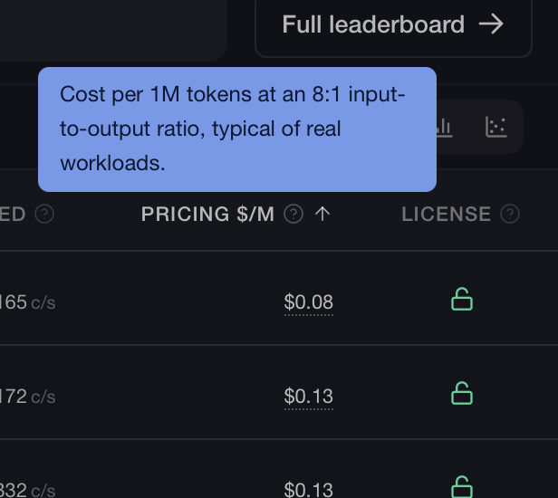
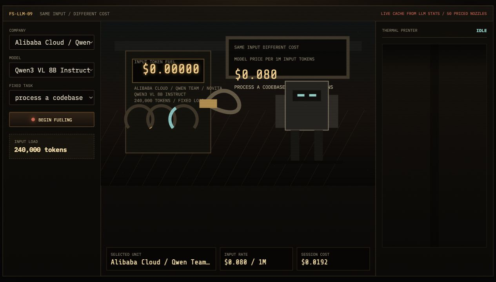
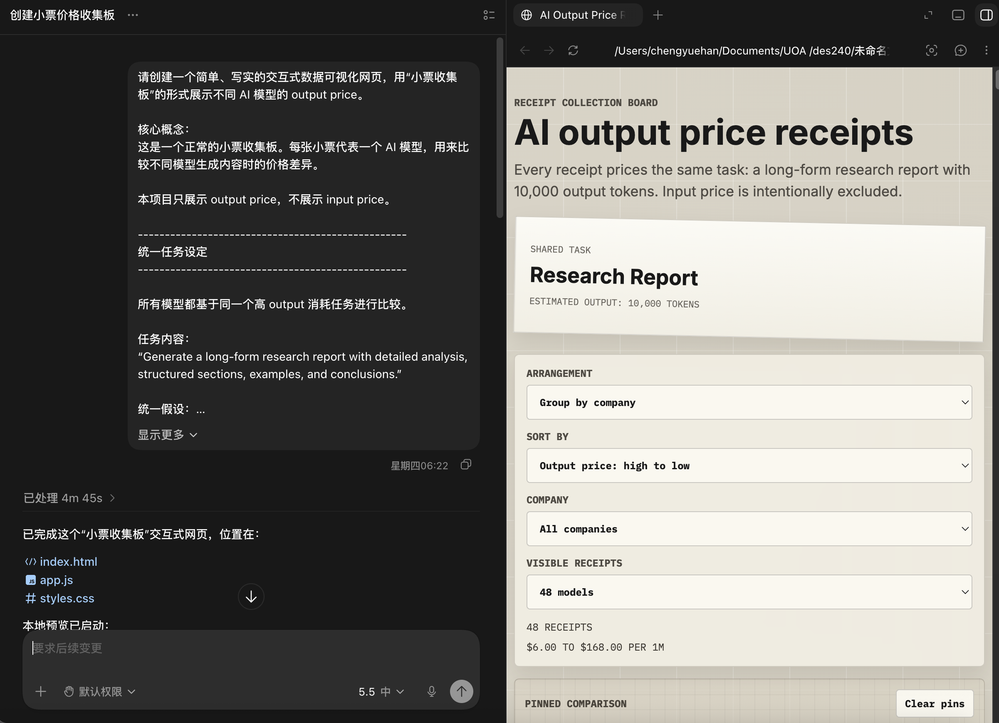

# Week 08

[← Back to Home](../index.md)

## Progress Report

In week 8, I prepared a short progress report on the current status of my project. I presented and explained it to my classmates in class, listened to their feedback, and provided feedback on their projects.

<iframe loading="lazy" style="position: absolute; width: 700; height: 450; top: 0; left: 0; border: none; padding: 0;margin: 0;" src="https://www.canva.com/design/DAHJCJVQIUE/cbhh54tOIdCnrXSbY60qwQ/view?embed" allowfullscreen="allowfullscreen" allow="fullscreen"></iframe>
=======
<iframe
  src="https://www.canva.com/design/DAHJCJVQIUE/cbhh54tOIdCnrXSbY60qwQ/view?embed"
  width="700"
  height="600"
  frameborder="0"
  allowfullscreen>
</iframe>

## Visual Research Shared in Class

In the visual research part of my presentation, I showed a creator I found on Xiaohongshu. This creator used vibe coding techniques to make different data visualisations based on a 3D Earth. I found this very interesting because the works looked visually polished and interactive, even though they seemed to be created through a vibe coding workflow.

This reference does not directly overlap with my own project. My project is not mainly about maps or geographic data, so there are not many specific visual methods I can borrow from it. However, it still gave me confidence. It made me realise that vibe coding is not only useful for making basic websites or dashboards. It can also be used to create visually engaging data visualisation works.

During the presentation, I also shared this visual research with a classmate whose project was more related to map-based data visualisation. I thought it might be more useful for their direction than mine, because their project could potentially borrow more directly from the 3D Earth format.

## Reflective Summary

After presenting my progress report, the feedback I received from classmates mainly focused on the meaning of the work and which model dimensions they thought were most important. One point was that the project should not only show model data, but also explain why this comparison matters. If the final outcome only presents numbers, it may become too close to a normal dashboard. It needs to guide the viewer to think about how AI models are compared and how these differences affect users.

Another useful piece of feedback was that my classmates seemed most interested in performance and price. This was meaningful because LLM Stats contains many dimensions, but not all of them are equally important to ordinary users. Performance is easy to understand because people want to know which model is stronger. Price is also important because it connects model comparison to the actual cost of using AI.

These responses helped me narrow the project direction. Instead of trying to include every field from the API, I should focus more on dimensions that viewers can quickly understand and care about. Performance and price may become the main comparison points, while other data such as speed and model context length can work as supporting information. This also helped me think about how to combine different capability dimensions into one data visualisation design.

Showing my PPT also helped me realise that the project needs a clearer message. The technical side is already possible, but the final visualisation needs to show more than technical success. It should make the comparison between AI models feel meaningful, especially around the relationship between model power, cost, and user choice.

## Project Development

After talking with my classmates, I started thinking about how to combine multiple model dimensions into one data visualisation. Since the feedback showed that people cared most about performance and price, I decided to start from the money side first. Price felt like a useful entry point because it is easier to understand than many benchmark scores, but it still connects directly to real AI use.

For large language models, the API price is usually divided into two parts: input price and output price. Input price is the cost of sending tokens into the model, while output price is the cost of the model generating tokens back. At first, I thought about whether I could combine these two values into one single price and visualise that instead. This seemed easier because one price would be simpler to compare across models.

LLM Stats also provides a fixed input-output price ratio, so this direction was technically possible. If I used one combined value, I could make the visualisation cleaner. It would also make the comparison easier to sort, because each model would only need one cost value.

However, after thinking about it more, I decided to give up this idea. Input price and output price are connected to different parts of model use, and they do not represent exactly the same process. Also, if I want to show price in a more direct and interesting visual way, combining input and output into one number may not be the best method. A single combined price may be easier to compare, but it removes the difference between sending information into the model and receiving generated information back.

Because of this, I decided that input price and output price should not be fully merged at this stage. They can still appear in the same visual idea, but they need to remain visually distinguishable. This pushed me to think about metaphors where input and output can be shown as two connected but different parts of the same system.

After that, I started looking for creative solutions to make AI API pricing less monotonous and boring than a dry price list. I wanted to avoid traditional charts like bar charts, tables, and line graphs. Instead, I wanted to find a more relatable and intuitive way to present model pricing.

The first complete idea I developed was the gas station metaphor. I started from the real experience of refuelling a car. If the same car goes to different gas stations and buys the same amount of fuel with different grades, the final price can still be different. This is similar to AI model pricing. If the user gives different models the same task and the same number of tokens, the cost will still change depending on the model.

This metaphor seemed useful at first because it connected price with consumption. API pricing is not a fixed purchase; it depends on use. Input tokens and output tokens are both counted, and the user pays based on how much is processed. Because of this, I started exploring visual elements from gas stations, such as price boards, fuel pumps, fuel nozzles, and fuel cost calculators. I also made an early version of the visualisation based on this idea.

After completing this demo, I began thinking about how to incorporate more capability dimensions into it. However, as I developed the idea further, I found that the metaphor started to break down.

The first issue was context length. I initially tried to connect context length with fuel tank capacity. At first glance, this seemed reasonable, since both are related to capacity. But within the gas station metaphor, the user is already imagined as driving the same vehicle to different stations. What is actually being compared is the price difference between different models for the same amount of input tokens. Because of this, using tank capacity to represent context length made the logic confusing.

The second issue was output pricing. I tried to explain output price as something like the cost of the return trip, or as a second fuelling process. But the more I tried to fit it into the metaphor, the more forced it felt. Output pricing is not an independent journey or another dramatic event; it is simply another rate within the pricing structure. If I forced every part of the API pricing system into the gas station story, the visualisation would become harder to understand rather than clearer.

So I returned to the existing gas station demo and looked at what part of it was actually useful. After some testing, I found that the first version could show the cost of one fuelling session, but it could not keep a record after each session. When users wanted to compare the prices of different models, they had to rely on memory alone.

I improved this by thinking about how the system could leave a record behind. After a brief brainstorming process, I came up with the idea of generating a receipt after each fuelling session, preserving the price information for each model. I then updated the demo by adding a receipt-printing module. After each receipt is printed, it is automatically pinned to the board at the bottom, allowing users to compare different model prices more easily.

[link to demo](../assets/week-08/index.html)

At this point, I started thinking: instead of showing the whole refuelling process, why not just show the receipt? The receipt is still connected to the gas station concept, but it is much simpler and clearer. It is also a very familiar object. People understand that a receipt records what was purchased, how much it cost, and where it came from.

This helped me shift the visual focus from the process to the result. Instead of trying to visualise fuel moving through a machine, I could present the final cost as a series of receipts. Each AI model could correspond to one receipt. The receipt could include the company name, model name, output price, and estimated cost. This is more direct, easier to understand, and easier to build than the full gas station metaphor.

The receipt idea also solved a practical problem. I wanted to show quite a large number of models, around 40 to 50. If each model became a complex machine or animated object, the page could become too crowded. But receipts are small, repeatable, and easy to compare. A receipt collection board can show many models at the same time while keeping the layout clear and readable.

After coming up with this idea, I turned the receipt feature, which was originally a supplementary module, into a separate module and quickly built it using Codex.

[link to demo](../assets/week-08/ai-output-receipt-board/index.html)

## AI Usage Statement

I used AI tools throughout this week's development process. ChatGPT helped me organise my  Journal, sumarize the conversation between me and AI, make my ideas into clearer English, and discuss how price and performance could become the main dimensions of the project. Claude was used during concept testing, especially when I was checking whether the gas station metaphor could also contain other dimensions such as context length and output pricing.

I also used Codex as a vibe coding tool to develop the prototypes. Codex helped me build and revise the gas station demo, add the receipt-printing function, and then separate the receipt board into its own prototype. 

OpenAI. (2026). *ChatGPT* (GPT-5.4 Thinking) [Large language model]. https://chat.openai.com/chat

Anthropic. (2026). *Claude* [Large language model]. https://claude.ai/

OpenAI. (2026). *Codex* (GPT-5.3 Codex) [Vibe coding agent]. https://openai.com/codex/