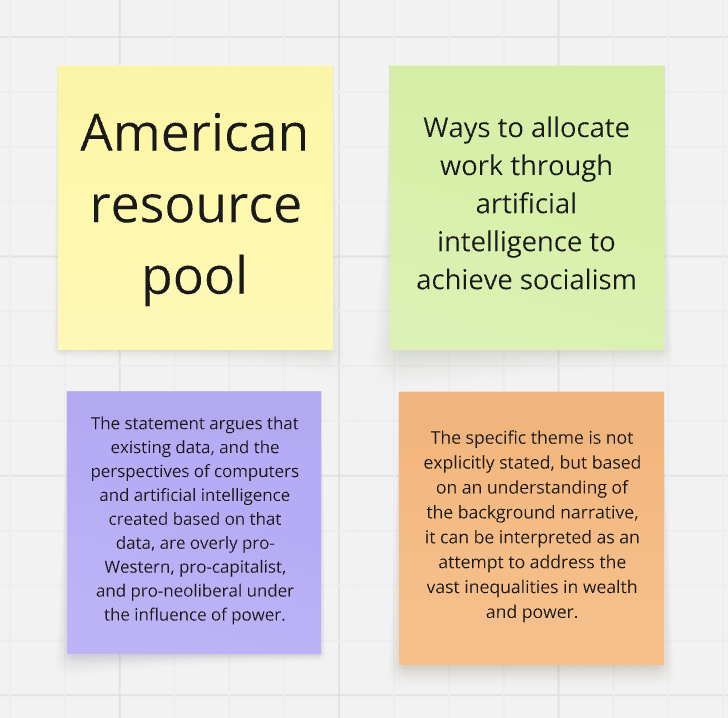
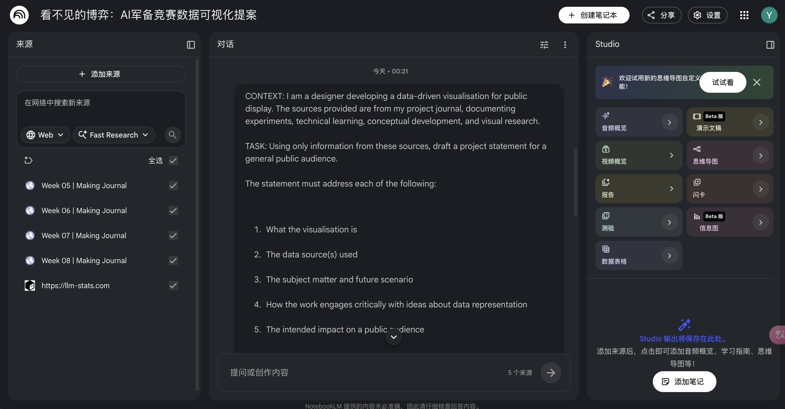
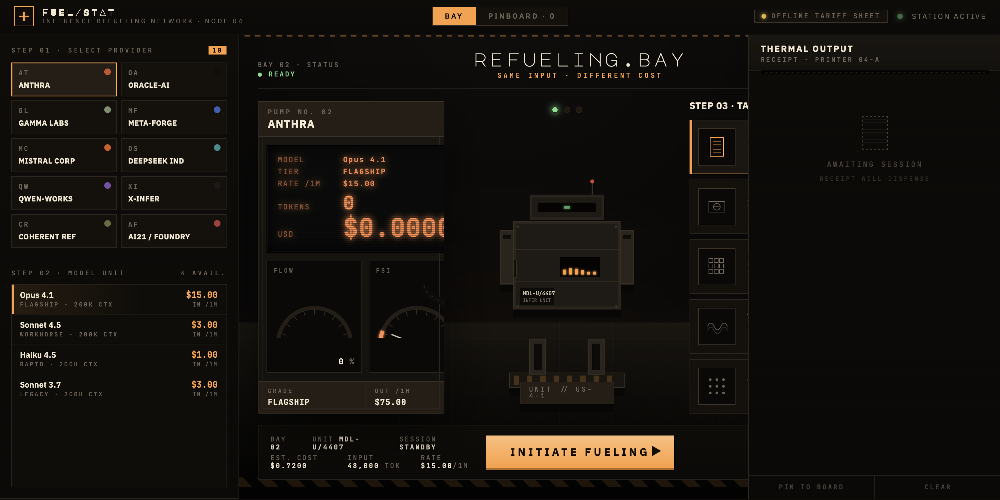
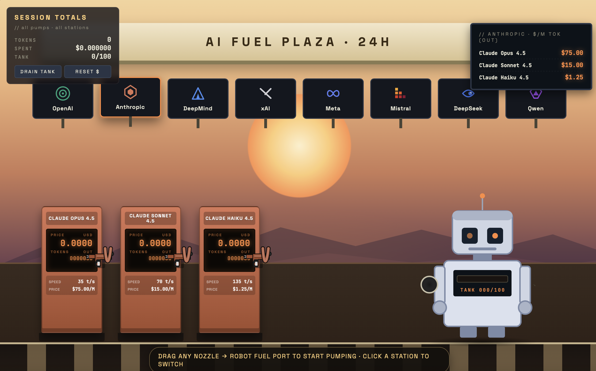
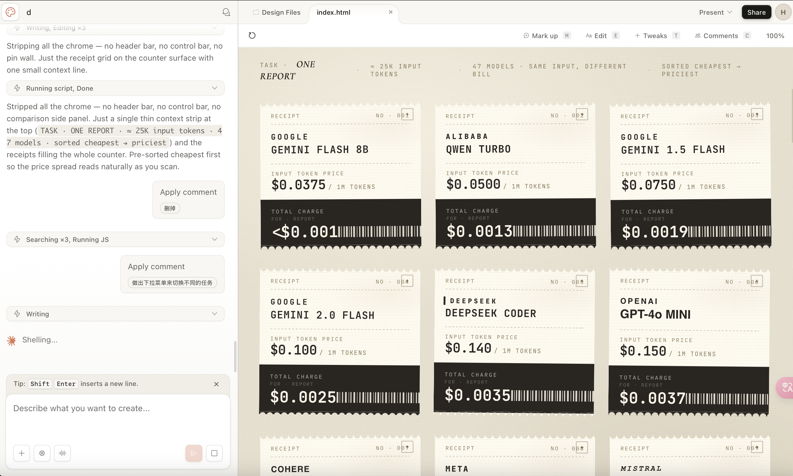

# Week 09

[← Back to Home](../index.md)

## Documentation

## Project Statement: First Draft

### Case Study



### Drafting with NotebookLM



```
   My project is an interactive data visualization designed to surface the hidden power structures of the global **AI arms race**. We are currently witnessing a rapid, competitive escalation of model capabilities where new releases claim higher benchmarks and lower prices every few days. I imagine a **future scenario** where these models are direct symbols of geopolitical and corporate power. In this trajectory, whoever controls the most powerful model controls access to decision-making and economic opportunity, while everyday users unknowingly serve as the fuel for this competitive fire.
   
   Using live data from the **LLM Stats API**, I track model rankings, pricing, and benchmark scores to construct a comparative picture of this competition. My work engages critically with data representation by moving away from traditional, abstract charts that are often too clinical for a general audience. Instead of relying on technical metrics like "token counts"—which are often too abstract for intuitive understanding—I "**de-chart**" the information through relatable, physical metaphors. I have developed a visual system that treats AI models like competing powers, eventually evolving into a **receipt-based interface**.
   
   By transforming raw API data into a collection of digital receipts, I shift the focus from abstract numbers to the tangible results of user interaction. These receipts record model names, providers, and costs, allowing for a direct and repeatable comparison that is easy to navigate. My **intended impact** is to provide the public with information that has previously been difficult to access behind a simple chat interface. I want to move users beyond an abstract feeling of model comparison, empowering them with the autonomy to make informed choices about the tools they use—choices they may never have been invited to make before.
```

### Evaluation 

* What is working well?

Presenting data to people in an interesting way

* What is missing or underdeveloped?

No, the current level is already quite comprehensive, even excessively so.

* What feels overly generalised or AI-like?

Like "AI arms race," "users as fuel," and "symbols of geopolitical power" are overly generalised. These words came easily when I was writing, but they actually overreach what my project can support, and they read like filler. These grand framings end up obscuring what I'm really trying to do: let ordinary people intuitively compare and choose between models.

* What do you need to research further?

Continue upgrading my webpage to generate the latest statement.

* Write one sentence that commits to the direction of your project.

"De-charting" information through relatable, physical metaphors.


## Making Sprint

In this week, I mainly tested how to make the interaction feel more natural. In the previous prototype, there were already some basic interactions, but many parts still depended on buttons, sliders, or normal selectors. These controls are clear, but visually they feel quite rigid.

Because of this, I started thinking about whether I could use a softer and more object-based way to create interaction. My goal is not to completely avoid buttons or sliders, but I do not want them to become the main visual language of the interface. I want the user's actions to feel more connected to objects inside the page, such as fuel pumps, fuel nozzles, price boards, or receipts.

Therefore, I brought back some gas station visual elements as an interaction test. For example, model price and generation speed do not necessarily have to be controlled only through sliders or dropdown menus. They could also be represented through visual elements that feel more like part of a scene. The purpose is to make the interface feel less like a control panel and more like a visual environment that can be operated.

After confirming this idea, I tried to use Codex to continue building the demo. I explained the direction to Codex: I wanted to make the interaction less dependent on rigid buttons and sliders, and make it feel more like object-based interaction inside a gas station scene.

However, this attempt with Codex did not go smoothly. It seemed to understand the general direction, but when it came to changing the webpage structure and interaction logic, the result was very weak. After many rounds of conversation and several version updates, the demo did not become closer to my idea. Instead, it doesn't quite paint the picture I want.


This process wasted a lot of time because I kept trying to fix the problems with new prompts, but each change created new problem. Since it became too difficult to continue fixing it in Codex, I decided to stop working on this direction there for the moment.

[link to the demo](../assets/week-09/demo/index.html)

## Project Development

After using Codex and finding that I was getting no usable result from this direction, my approach changed for a reason outside the project itself. Around this time, a friend of mine returned to China and passed his Claude Max subscription on to me(thank him🙏🙏🙏🙏🙏). Because of this, I was able to access the Claude family of coding agents for the first time.

I decided to try the recently released Claude Design to rebuild the design, to see if a different coding agent could do better than Codex.

At first I just used the same prompt I had been giving Codex. This prompt was a very long block of text that ChatGPT had summarised from my earlier conversations about the idea. It was so long that I could not scroll to the bottom of it. After I put the same content into Claude Design and waited, the result was almost the same as the one from Codex.

[](../assets/week-09/i-2/Fuel%20Station.html)⬆️click image to see the demo

This made me realise the problem was probably not the tool, but the prompt. Both agents gave almost the same result, which meant they were both faithfully following the same prompt. When I looked more carefully, I noticed that somewhere inside this long prompt — which I had never actually read to the end — it was already describing an interface that was not the one I wanted. So the agents were doing what the prompt asked; it just was not what I had in mind. So I stopped trying to fix the output and went back to rethink the idea, and to write the instructions myself this time.

While rethinking the idea, I made the most important decision of this week: I changed the dimension from input price to output price. This sounds like a small change, but it solved a problem that had been blocking me since Week 8. Back then the gas station metaphor kept breaking down because I could not fit output pricing into it, and input price on its own only connected to context length, which did not really suit the refuelling action.

Once I switched to output price, the whole scene started to work. Output price is the cost of the model generating tokens back, so it matches the idea of fuel coming out much more naturally than input price did. More importantly, this opened space to add a second dimension: the model's output speed. I could use output speed to control how fast the tank fills up during refuelling. This means the price and the generation speed are no longer two separate numbers — they are both shown through one refuelling action. A faster, cheaper model fills up quickly and cheaply; a slower, more expensive one does the opposite. This was the moment the gas station idea finally held two dimensions at once instead of falling apart.

After this, I wrote the prompt myself instead of using the long summarised one, and I got the result I wanted.(⬇️click image to see the demo)

[](../assets/week-09/i-2/AI%20Fuel%20Station.html)

After finishing the output-price gas station scene, I also used Claude Design to rebuild the receipt version for input price.  Using Claude Design and a prompt I wrote myself, the [Claude rebuilt receipt version](../assets/week-09/r.html) came out cleaner and closer to what I wanted than the earlier [Codex version](../assets/week-08/ai-output-receipt-board/index.html).



## AI Usage Statement

Artificial intelligence tools is use to help draft and evaluate the project statement and refine the written reflection. AI was also used for coding support during the prototype development process. 

Google. (2026). *NotebookLM* (AI Notebook). https://notebooklm.google.com/

OpenAI. (2026). *ChatGPT* (GPT-5.4 Thinking) [Large language model]. https://chat.openai.com/chat

OpenAI. (2026). *Codex* (GPT-5.3 Codex) [Vibe coding agent]. https://openai.com/codex/

Anthropic. (2026). *Claude Cowork* (AI agent). https://claude.ai/

Anthropic. (2026). *Claude Design* (Vibe design agent). https://claude.ai/design

