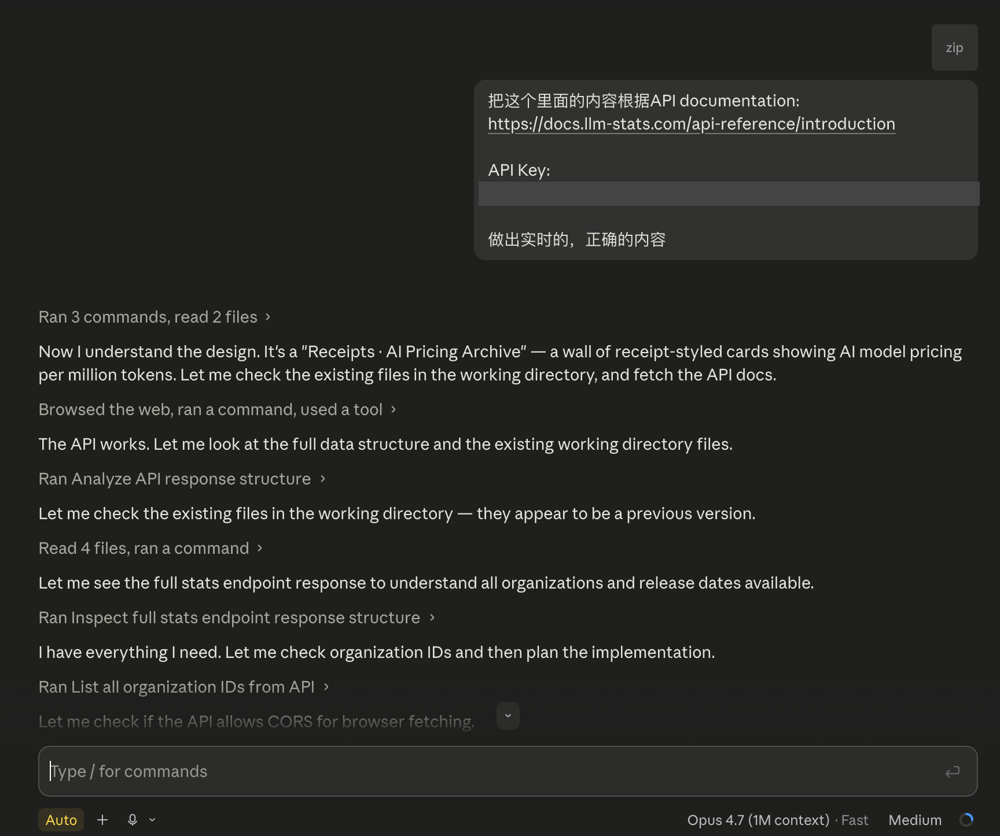
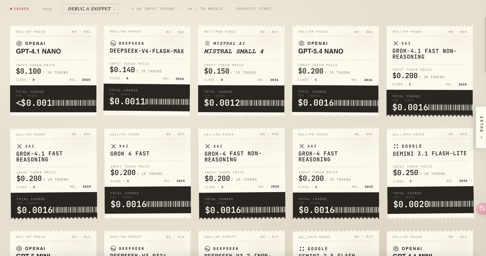
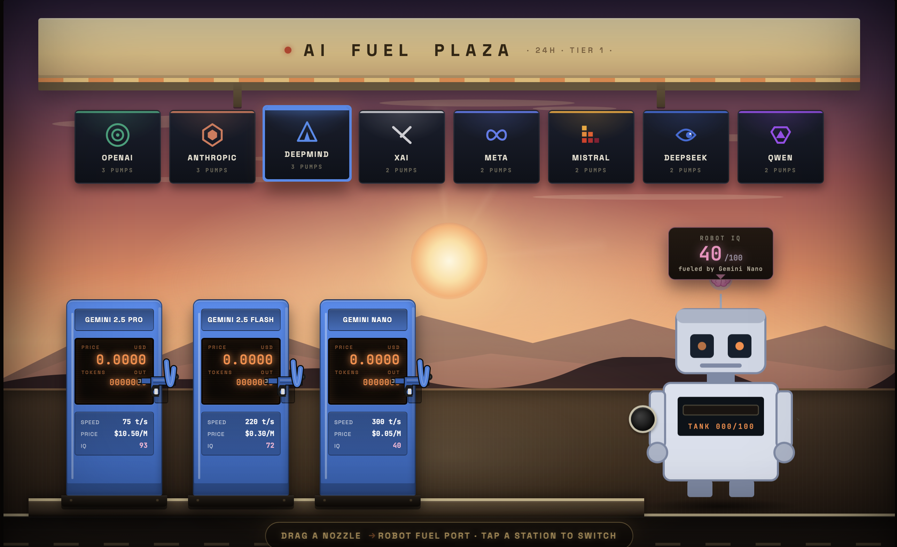
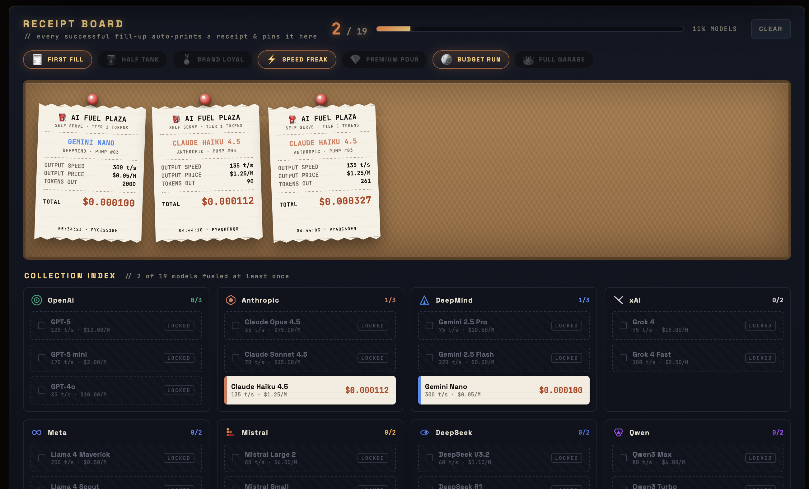
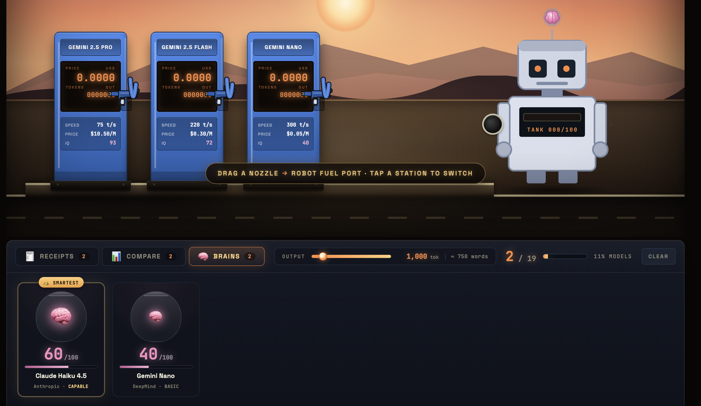
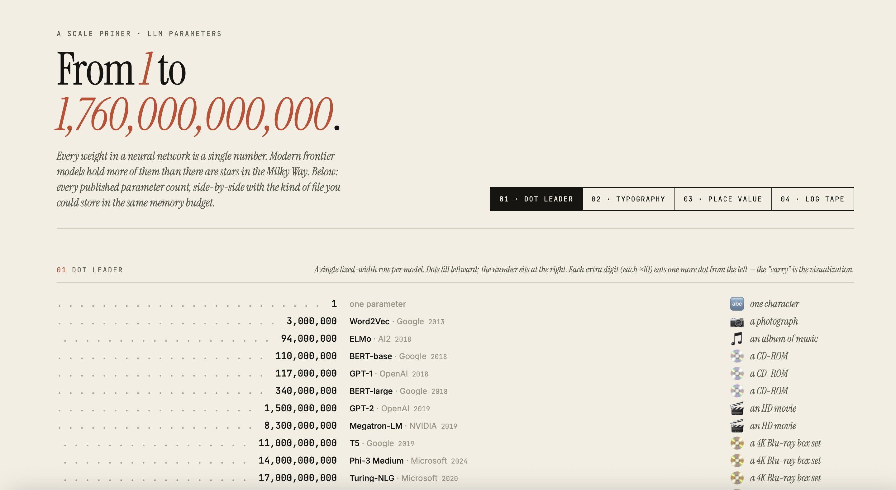
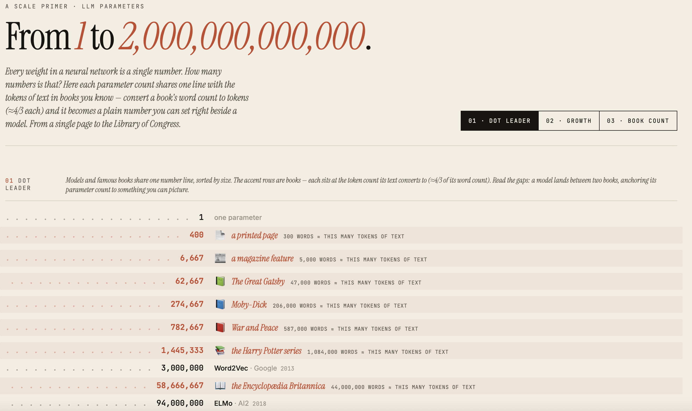

# Documentation

## Project Development

The prototypes I designed in Claude Design last week looked the way I wanted, but they were still running on sample data rather than real model information. This week I focused on connecting them to live data. I took the demo prototype from Claude Design and gave it to Claude Code, and used it to connect the prototype to the LLM Stats API.

After this, the prototype became a real, working webpage instead of a design mockup. It now pulls live data from the API, so the prices and other values shown in the page are real and up to date rather than placeholder numbers.

I also optimised the logic of the input options this week, mainly by making them closer to everyday life. Instead of asking the user to deal with abstract amounts of input, I changed the options to relatable, real-life examples, so the input feels like something a normal person would actually do rather than a technical setting.

⬆️click image to see

Connecting the prototype to the API also confirmed something useful about my workflow: a design made in Claude Design could be handed over to Claude Code and actually turned into a working webpage with real data. This mattered because, until I had tested it, I was not sure the design and the implementation would fit together. Once I knew the handoff worked, I felt safe to keep investing in the design side, because I now trusted that what I designed could later be built for real. So I went back and continued to improve the gas station design.

At this point I started thinking about how to fit more dimensions into the gas station metaphor, especially the capability side of the models, not just their price and speed. So far the scene could show output price through the fuel cost and output speed through how fast the tank filled up, but capability had no place in it yet. This was the hardest dimension to include, because price and speed are both about the act of refuelling, while capability is about the model itself. The easy solution would have been to add a number, a bar, or a label somewhere on the side, but that is exactly the kind of chart-like element I had been trying to avoid since the start of the project. I did not want capability to sit outside the scene as extra data; I wanted it to come from something already inside the picture.

The idea actually came from the design itself. While I was looking at the robot Claude Design had drawn, I noticed a small circle on top of its head. At first it was just a small graphic detail, but the more I looked at it, the more it read to me like a brain, or a chip. That connection felt natural: a brain sits at the top of the head, and it is the part we associate with how clever or capable something is. So a model with a stronger brain would simply be a more capable model. I realised I did not need to invent a new element at all — this small circle that was already part of the robot could carry the capability dimension on its own.

In this way, the design from Claude gave me the inspiration I needed. It let me successfully avoid the traditional, chart-like way of showing model performance, and at the same time keep the style and the metaphor consistent across the whole demo. Capability no longer had to be a number bolted onto the side; it could live inside the same world as everything else. So I started to bring this idea into the demo.

⬆️click image to see demo

After this, I added back the receipt comparison feature. Earlier, while I was writing the prompts myself, I had left it out so I could keep each prompt focused and build the main scene first. Now that the scene was working, it was a good time to bring it back. With the comparison in place, the user is no longer limited to one model at a time; the receipts let them line different models up and compare them directly, which had been the point of the project from the beginning. At the same time, I added an achievement system that the user can unlock, which makes the whole thing feel more like a game than a plain comparison tool.

The testing process makes me to think about: whether to give the user a way to skip or speed up the refuelling while a model was filling up. A skip or fast-forward button would be the obvious thing to add, since waiting can feel slow, and in most games or apps people expect to be able to move things along. But in the end I decided not to add it. The speed of the refuelling in my project is tied to the model's real output speed, so the waiting is not just dead time — it is part of what the visualisation is trying to show. In a real situation you cannot ask a model to answer your question any faster than it does. So the timing you are waiting is part of the visualization.

⬆️click image to see demo

That said, I did not want to force every user to sit through the longest possible wait either. So instead of a skip button, I gave them control in a way that stays true to the metaphor. The output had been a fixed default amount, and I changed it into a slider, so the user can choose how much text they want the model to generate. 

I also thought about what the user would actually want to do with all of this. Beyond seeing the price and the speed, people want to compare how capable the different models are. Since I had already turned the robot's brain into the way capability is shown, it made sense to build on that and add a way to compare the capability of different models directly, so that capability sits alongside price and speed as something the user can weigh up when choosing between models.

.html)⬆️click image to see demo

Once this version was done, I was basically happy with how the demo worked, so I sent it over to Claude Code to be implemented properly. While Claude Code was building it, I took the chance to step back and review the project as a whole.

Doing this, I realised that of all the dimensions I had wanted to show, only two were still missing, and they happened to be the two that are hardest to handle: the model's parameter count and its context length. Both of these are about visualising very large numbers — billions of parameters, or context windows of hundreds of thousands to millions of tokens — and this is the same problem I ran into back in Weeks 6 and 7, when I tried and failed to show context length through a real book. Numbers at that scale are hard to make intuitive, so I still need to find a way to fit them into the scene without falling back on a plain figure.

While Claude Code was still building, I used the time to look for inspiration, mainly on [Information is Beautiful](https://informationisbeautiful.net/). I was specifically looking for ways other people had handled very large numbers, since that was the problem still in front of me. It did not take long before I found something that fit my theme well: a visualisation called [Per Second](https://informationisbeautiful.net/2024/per-second-vibrations-cycles-waves-rate-frequency/).

What this piece does is lay out a huge range of "per second" rates on a single scale — from slow, everyday vibrations, up through sound, then radio, and all the way to light. These values span many orders of magnitude, the kind of jump that is normally impossible to picture, and yet the visualisation makes them feel readable. It places each one on a continuous scale and ties it to something familiar, so a viewer can feel where a value sits relative to things they already know, instead of trying to imagine the number on its own. A frequency you have never heard of suddenly makes sense because it is sitting next to a heartbeat or a musical note.

This was exactly the problem I had with parameter count and context length. On their own, "a few hundred billion parameters" or "a context window of a million tokens" are just big words; almost no one has an intuitive sense of how big they really are, or how one model compares to another. What I took from this reference is that I should not try to show these numbers directly. Instead I should give them a scale and familiar anchor points, so the viewer feels the difference between a small model and a huge one, rather than reading two large numbers and feeling nothing. It reinforced the direction I had been heading in all along — turning abstract data into something you can sense — and gave me a concrete way to think about the last two dimensions I still needed to solve.

With this in mind, I built a first version that tried to attach real-world capacity references to each model, so the user would have something familiar to measure the numbers against. I was not happy with how it came out. Claude Design did not place these references inside the list itself, where they could be read together with everything else. Instead it put them as a separate strip down the right-hand side, with each reference quantifying a single model on its own — how big this one model is, in isolation. That broke the whole point of the idea, because the value of an anchor comes from comparison: you understand a number by seeing it next to others, not by reading it alone in a side column.

⬆️click image to see demo

One thing about this first version did work for me, though. Instead of settling on a single picture, it presented the same parameter-scale data through several tabs, each one a different way of reading it. After going through them, I decided to keep this multi-tab way of showing the data. The *Per Second* piece that inspired me is a single static image, so it has to commit to one view. My project is a webpage, which means it does not have that limit — it can hold several views at once and carry more dimensions than a fixed image can. Keeping the tabs lets me offer more than one way into the same numbers, which suits the project better than forcing everything into a single layout.

I also talked it through with AI in more detail. Claude pointed out a risk with using capacity-style measurement units as the anchor. The problem is not that these values are not a kind of capacity, but that the same capacity does not map consistently to the same parameter count or context length. Two files of the same size could correspond to quite different amounts, so anchoring to a capacity unit can be inconsistent. For parameter count this is probably acceptable, but for context length it could be a real problem, because the same nominal capacity can translate into very different token counts depending on the content. I thought this was a fair point, so I took the advice and changed all of the anchors I was using from unit-based measures to plain text instead, which describes the scale without relying on a unit that can mislead.

From here, I kept refining the idea together with Claude Design, and after several rounds I reached a demo version I was finally happy with. This version does two things at once: it shows the scale intuitively, and it also reveals the trend of how the numbers have grown over time, so you can see not just how big each model is but how quickly things have moved. On top of that, it lets you look into a single model and understand what its huge number is actually made up of, rather than seeing it only as one large figure. I will build these two demos — for parameter count and for context length — after I have finished the gas station part of the project.

⬆️click image to see demo

## Reference

McCandless, D. (2024). Per Second – Vibrations / Cycles / Waves / Rate / Frequency [Infographic]. Information Is Beautiful. https://informationisbeautiful.net/2024/per-second-vibrations-cycles-waves-rate-frequency/

## AI Usage Statement

I used AI tools this week mainly for coding. Claude Code was used to connect my Claude Design prototype to the LLM Stats API and turn it into a working webpage that runs on live, accurate data. I also used AI to help polish the writing in this Journal. 

Anthropic. (2026). *Claude Design* [Vibe coding agent]. https://claude.ai/design

Anthropic. (2026). *Claude Code* [Vibe coding agent]. https://claude.ai/code

OpenAI. (2026). *ChatGPT* (GPT-5.4 Thinking) [Large language model]. https://chat.openai.com/chat

