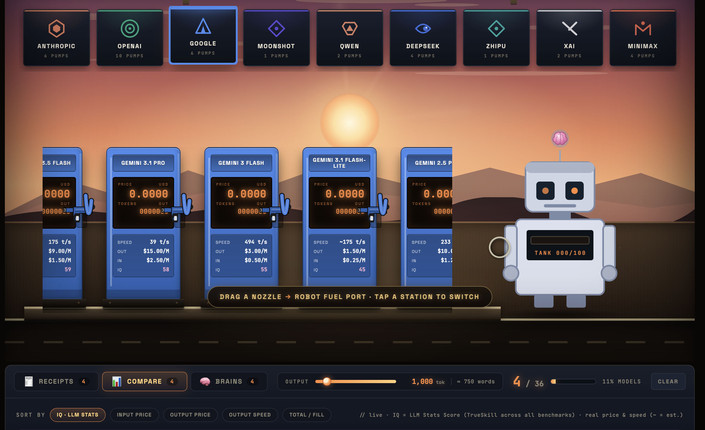
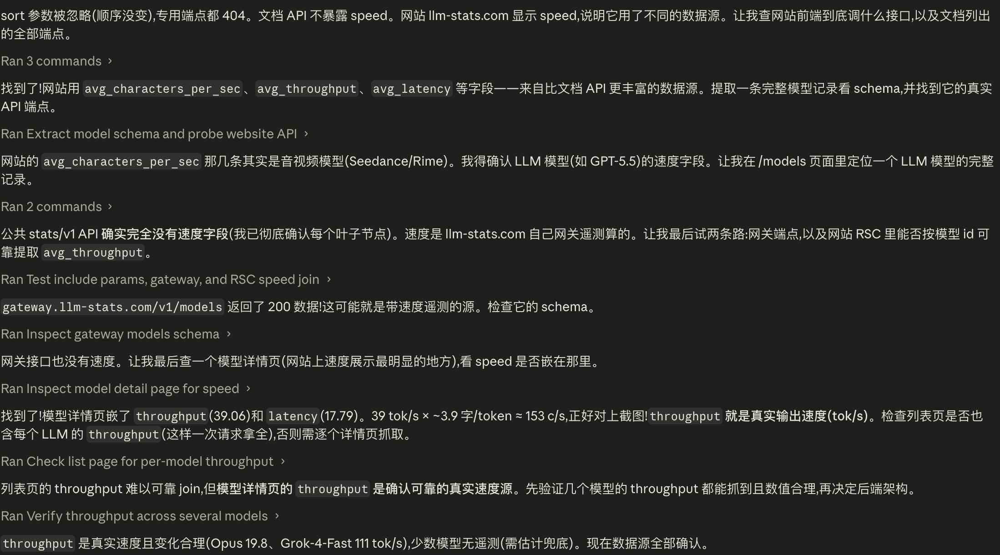
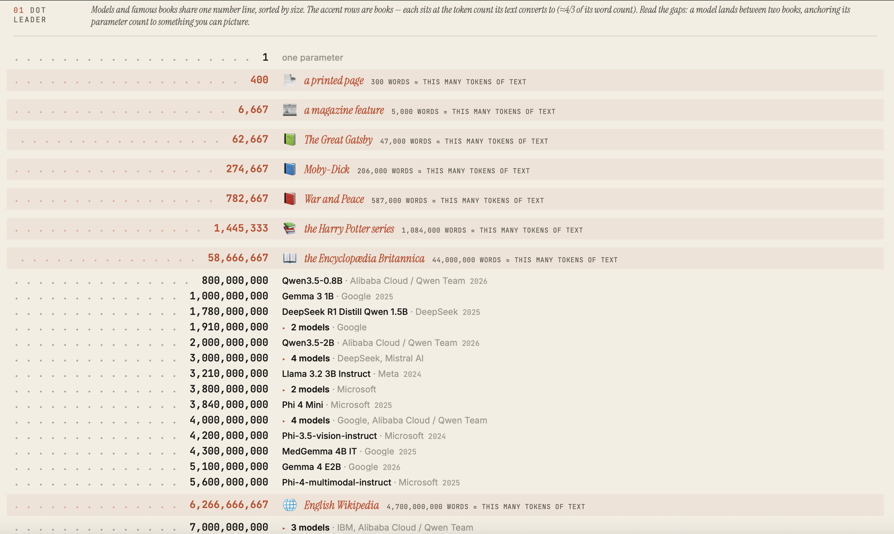
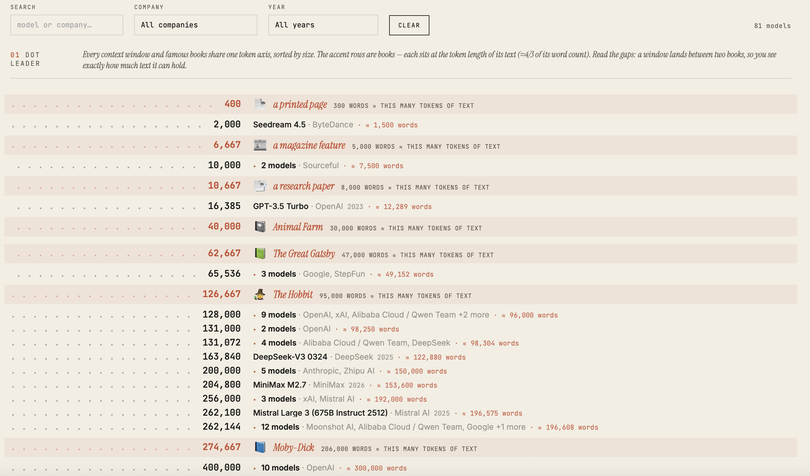
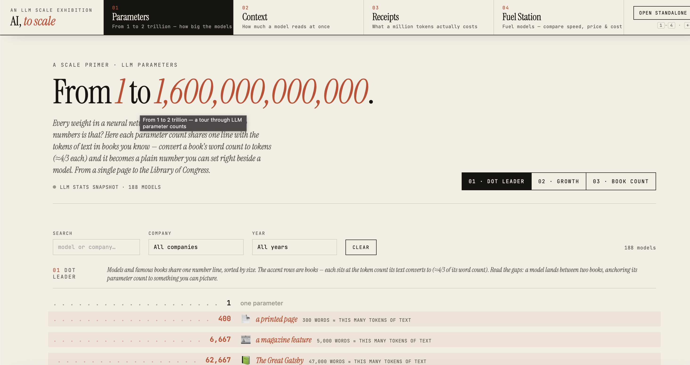

# Week 11

[← Back to Home](../index.md)

## Documentation

## Checklist 

## Project Development

⬆️click image to see

After a long stretch of back-and-forth with Claude Code, I finally finished the live, API-connected version of the gas station. Up to now the gas station had mostly been a design running on sample values, so this was the step that turned it into a working version pulling real data, the same way I had already done with the receipt prototype.

Connecting it to live data also brought out a problem I had to deal with directly: the data has a lot of missing information. Not every model in the source returns a complete set of fields, and a model with gaps would either break the scene or show empty values that look wrong. Rather than display these incomplete entries, I decided to only include the models whose information is complete enough to be shown properly. This keeps the gas station accurate and readable, even though it means the page shows fewer models than the source actually lists.

the process that finding the speed

Exploring the API was also not as smooth as I had imagined. I had assumed most of what I wanted to show would be there to read off directly, but it turned out that many of the values shown on the page actually have to be calculated from the raw data rather than taken straight from a field. Speed was one example of this. To work out how to derive it correctly, I had Claude Code research the problem for a while, and after some time it found a way to calculate and implement it from the data that was available.

With the gas station finished, I could finally focus on the last two pieces of content: parameter count and model context length. I took the demo I had already reviewed and approved and sent it to Claude Code to implement. Once Claude Code returned the result, I noticed that the real data did not behave the same way as the sample data had. One thing that stood out was that many models share the same parameter count. To handle this, I made a collapsible design, so models with identical parameters can be folded together instead of each taking up its own row. This saved a lot of screen space. On top of that, because the amount of data was large, I added a filter function to both visualisations, so a viewer can narrow things down and find the data they are looking for quickly instead of scrolling through everything.

⬆️click image to see

After finishing the parameter count visualisation, I moved on to building the context length visualisation. Here the range was different: the largest value only reaches about 2M tokens, which is much smaller than the parameter counts that ran up into the trillions. Because of this smaller ceiling, I optimised the logic used to display the amounts, and added more markers to the scale within the 2M range, so that the comparison stays detailed across this narrower range instead of leaving most of the values bunched together at one end.

This smaller range also changed how I labelled it. Because the maximum context length is only around 2,000,000 tokens, the equivalent word count is actually a useful reference for a person — it is a number you can picture. So for each model I converted its token count into a word count and displayed that on top. This is different from the parameter count, where the numbers were too large to convert into anything meaningful and I had to fall back on plain-text anchors instead.

⬆️click image to see

By this point I had all four parts I had wanted, each with its own working interface: the gas station, the receipt comparison, the parameter count visualisation, and the context length visualisation. The next step was to bring them together and integrate them into a single website.

⬆️click image to see

Claude Code did this well and returned a single page that switches between the four visualisations using four tabs at the top. After thinking about it, though, I felt the project still needed a proper home page to introduce and present these visualisations, rather than dropping the viewer straight into the tabs. I also noticed that the gas station looked quite different in style from the other three visualisations, which made the whole thing feel a little inconsistent. So I decided to unify their styles so the four parts would sit together as one coherent website.

    <iframe
        src="../assets/week-11/综合v2/index.html"
        width="1920"
        height="1000"
        style="border:none;">
    </iframe>

## AI Usage Statement

I used AI tools this week for design, coding, and writing. Claude Design was used to keep refining the visualisations and to work on unifying their style, and Claude Code was used to do most of the implementation: connecting the gas station to the live API, working out values such as speed that had to be calculated from the raw data, building the parameter count and context length visualisations, and combining the four parts into a single website. I also used AI to help polish the writing in this entry.

Anthropic. (2026). Claude Code [Vibe coding agent]. https://claude.ai/code

Anthropic. (2026). Claude Cowork [AI agent]. https://claude.com/product/cowork

